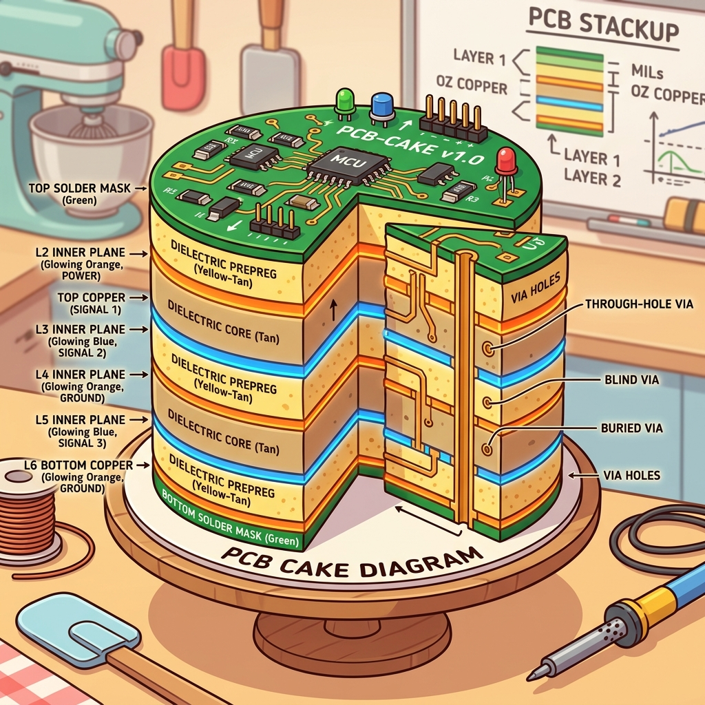

# Section 1.1: Location, Location, Location: PCB Layout Best Practices

So, you've got this shiny new AMD FPGA. It’s got more gates than a billionaire's estate and more I/O pins than a porcupine in a balloon shop. You're probably itching to start writing RTL and watching those LEDs blink. But hold your horses, partner.

Before you even think about code, we need to talk about where this silicon beast is going to live. If you mess up the PCB layout, it doesn't matter how brilliant your Verilog is. Your board will be about as useful as a chocolate teapot. Layout is the foundation of everything.

### The Footprint: Don't Trip on the First Step

Imagine trying to build a skyscraper on a foundation made of wet marshmallows. That’s what happens when you use a generic footprint for a high-performance AMD device. These chips aren't your grandpa's through-hole resistors. They are high-density BGA (Ball Grid Array) masterpieces that require precision.

You need to make sure your CAD library is using the exact manufacturer's specifications. A half-millimeter shift in a pad might not sound like much. But when you have 1,500 balls under a single chip, that shift is a recipe for a very expensive short circuit. Always download the official UltraFast-compliant footprints if you value your sanity.

> **Brain Power**
> **If you have a 0.8mm pitch BGA, and your manufacturer's minimum trace width is 4 mils, how many traces can you realistically fit between two pads without causing a crosstalk nightmare? Stop and visualize the geometry before you answer.**

### Escape Velocity: The Great BGA Breakout

Getting signals out of the middle of a BGA is like trying to exit a crowded stadium after a championship game. Everyone is pushing, the exits are narrow, and if you aren't careful, somebody's getting stepped on. This is what we call "fanout" or "breakout" routing.

You can't just drag traces out at random. You need a strategy, usually involving "dog-bone" vias or via-in-pad technology. AMD devices often have specific recommendations for which layers to use for high-speed signals versus low-speed control lines. If you put your 10Gbps transceiver trace right next to a noisy switching regulator, you’re going to have a bad time.


### Fireside Chat: The Signal and the Plane

**Signal Trace:** "Look, I just want to get to the other side of the board. Why do I have to worry about what's happening underneath me?"

**Ground Plane:** "Because I'm your shadow, buddy! If you move, I move. If you jump over a gap in my copper, your return current has to take the long way around. And trust me, 'the long way' means EMI problems that will make the FCC knock on your door."

**Signal Trace:** "So what? It’s just electricity."

**Ground Plane:** "It's physics! High-speed signals are like a high-speed train; they need a solid track. If the track disappears, the train derails. Stay over my solid copper, or don't complain when your data turns into gibberish."

### Signal Integrity: The Speed Limit of Reality

In the old days, a wire was a wire. You connected A to B, and the signal showed up. But when you’re dealing with the speeds of modern FPGAs, every trace becomes a transmission line. It has inductance, capacitance, and a mind of its own.

Trace impedance is what keeps your signals from bouncing back like a tennis ball hitting a wall. The mechanism is the reflection coefficient at a discontinuity, $\Gamma = (Z_L - Z_0)/(Z_L + Z_0)$: a 50 ohm trace hitting a 75 ohm connector gives $\Gamma = 25/125 = 0.2$, so a fifth of your signal amplitude turns around and travels back up the line. Those reflections are the "ghosts in the machine" that cause intermittent crashes and bit errors. You need to calculate your trace widths based on your board's stackup to hit that 50-ohm (or 100-ohm differential) sweet spot.

### The Analogy: The Plumbing of Data

Think of your PCB traces as pipes in a high-pressure plumbing system. If you have a 90-degree elbow in a pipe, the water hits the wall and creates turbulence. In a PCB, a sharp 90-degree corner does the same thing to your signal—it creates a capacitive "bump" that ruins your signal integrity.

This is why you see engineers using 45-degree angles or smooth curves. We want the data to flow like silk, not like a car crash. If your traces are different lengths, it's like two runners starting a race at different times. They won't reach the finish line (the receiver) together, and your data will be "skewed." Length matching is the stopwatch that keeps your data bits in a straight line.

### The Layer Cake: A Stackup for Success

A four-layer board might work for a hobby project, but for an AMD UltraScale+ design, you’re looking at 10, 12, or even 16 layers. This isn't just about fitting all the traces. It's about creating a "sandwich" of signal and power planes that shield each other.

You want your high-speed signals to be adjacent to a solid ground plane. This provides a clear return path and minimizes the loop area. A smaller loop area means less radiated noise. If you stack two signal layers right on top of each other, they’ll start "talking" through crosstalk. Nobody wants their memory bus to know what the Ethernet controller is saying.



### Code Detective: The DRC Script

When you're working in Vivado, you might use Tcl scripts to automate your layout checks. But even scripts can lie to you if you aren't paying attention. Check out this snippet intended to flag unconstrained pins.

```tcl
# Code Detective: Find the logic flaw!
set all_pins [get_pins -hierarchical]
foreach pin $all_pins {
    set constraints [get_property PACKAGE_PIN $pin]
    if { $constraints == "" } {
        puts "WARNING: Pin $pin has no location assigned!"
    }
}
# Hint: Does 'get_pins' always return what you think it does for top-level ports?
```

Did you spot it? `get_pins` returns internal pins of cells. If you want to check the actual I/O pins of your FPGA package, you should be looking at `get_ports`. If you run this script, you'll get a mountain of warnings about internal flip-flops that *obviously* don't have package pins, while your missing top-level constraints sail right through unnoticed.

**The fix.** Iterate ports, and check the `IOSTANDARD` too — a port with a `PACKAGE_PIN` but no `IOSTANDARD` still fails DRC:

```tcl
# Corrected: run against an open elaborated/synthesized design.
proc report_unconstrained_io {} {
    set missing 0
    foreach port [get_ports *] {
        set loc [get_property PACKAGE_PIN $port]
        set std [get_property IOSTANDARD  $port]
        if {$loc eq "" || $std eq ""} {
            puts [format "%-28s LOC=%-10s IOSTANDARD=%s" \
                [get_property NAME $port] \
                [expr {$loc eq "" ? "MISSING" : $loc}] \
                [expr {$std eq "" ? "MISSING" : $std}]]
            incr missing
        }
    }
    puts "$missing unconstrained port(s)"
    return $missing
}
```

Vivado ships the same check as two DRC rules, and you should run both before you ever
write a bitstream — `UCIO-1` for unconstrained logical ports and `NSTD-1` for ports with
no I/O standard:

```tcl
report_drc -checks {UCIO-1 NSTD-1}
```

Both are promoted to errors during `write_bitstream` for exactly this reason: an
unplaced port gets a pin the tool picked for you, and the tool has never seen your
schematic.

### The Technical Deep Dive: Impedance and Vias

Let’s get nerdy for a second. Trace impedance ($Z_0$) is determined by the ratio of the trace width to the height above the ground plane, and the dielectric constant of the board material (usually FR-4). If you change the dielectric, your impedance changes. If you move a trace to a different layer, your impedance changes.

Vias are another hidden trap. Every time a signal goes through a via to a different layer, it encounters a change in impedance. It's like a speed bump. For truly high-speed signals (like 28Gbps GT transceivers), you even have to "back-drill" the vias to remove the unused "stub" of copper. That tiny stub acts like an antenna, sucking energy out of your signal and radiating it into the void.

### Thermal Relief: Keeping it Cool

FPGAs get hot. Really hot. They can draw dozens of amps at low voltages. If your layout doesn't provide a path for that heat to escape, your chip will throttle itself or simply melt. You need thermal vias—little copper chimneys that carry heat from the bottom of the chip down into the inner ground planes.

Think of the ground planes as a giant heat sink built into the board. The more copper you have, the better your thermal performance. But be careful—if you connect a component directly to a massive copper plane without "thermal relief" pads, you'll never be able to solder it. The plane will suck all the heat out of your soldering iron faster than you can apply it.

### Analogy → Silicon

Every metaphor above is an on-ramp. Here is where each one actually lands, and — just as
important — where it stops being true:

| In the story | In the silicon / on the board | Where the analogy breaks |
| --- | --- | --- |
| Skyscraper on marshmallows | The BGA land pattern from the AMD package file (`.pkg`/footprint), not a hand-drawn one | A building settles slowly; a wrong land pattern fails immediately at reflow, or worse, passes AOI and fails at temperature |
| Exiting a crowded stadium | BGA escape ("breakout") routing: dogbone vias, via-in-pad, HDI microvias | Stadium exits get faster when you add people-flow; escape routing gets *slower* per row as you go inward, because inner rows have fewer channels available |
| Your shadow, the ground plane | The return current path directly under the trace, in the adjacent reference plane | A shadow tracks you for free; return current tracks you only if there is unbroken copper — a plane split makes it detour and radiate |
| 90° elbow in a pipe | Impedance discontinuity: a local capacitance bump at the corner | Water turbulence is continuous loss; a trace corner is a *reflection*, which can constructively add at the receiver and only matters relative to your signal's rise time |
| Layer cake | The stackup: signal/reference pairs and their dielectric heights | Cake layers are interchangeable; swapping a signal layer changes $Z_0$, because impedance depends on height above its reference |
| Two runners in a race | Length/skew matching within a byte lane or differential pair | Runners can be told to wait; skew is only fixable by adding physical length, and only up to the fabric's own skew budget |

### Do the Math

The single most consequential number on a large BGA board is **how many traces fit
between two adjacent via lands**, because that number sets your layer count, and layer
count sets your board cost. Let's compute it.

**Givens** (these come from your package file and your fab's capability sheet — get the
real ones, do not reuse mine):

| Symbol | Meaning | Value |
| --- | --- | --- |
| $p$ | BGA ball pitch | 1.0 mm = 39.37 mil |
| $d$ | Via land (pad) diameter your fab will guarantee | 22 mil |
| $w$ | Minimum trace width | 4 mil |
| $s$ | Minimum copper-to-copper clearance | 4 mil |

**Step 1 — channel width.** The copper you actually get between two lands is the pitch
minus one land diameter:

$$c = p - d = 39.37\ \text{mil} - 22\ \text{mil} = 17.37\ \text{mil}$$

**Step 2 — how many traces fit.** $n$ traces in that channel need $n$ widths and $n+1$
clearances (land, gap, trace, gap, trace, gap, land):

$$n \cdot w + (n+1) \cdot s \le c \quad \Longrightarrow \quad n \le \frac{c - s}{w + s}$$

$$n \le \frac{17.37 - 4}{4 + 4} = \frac{13.37}{8} = 1.67 \quad \Longrightarrow \quad n = 1$$

**One trace per channel.** Roughly, one ball row escapes per signal layer per side, so a
device needing eight rows of signal escape needs on the order of eight signal layers,
which — with a reference plane between them — is a 16-layer board.

**Step 3 — find the lever.** Which given should you push on? Try tightening the trace
rules to 3.5 mil / 3.5 mil, which costs real money at the fab:

$$n \le \frac{17.37 - 3.5}{3.5 + 3.5} = \frac{13.87}{7} = 1.98 \quad \Longrightarrow \quad n = 1$$

Still one. You paid for a tighter process and bought nothing. Now instead move to
via-in-pad with an 18 mil land:

$$c = 39.37 - 18 = 21.37\ \text{mil}, \qquad n \le \frac{21.37 - 4}{8} = 2.17 \quad \Longrightarrow \quad n = 2$$

**Verdict: two traces per channel halves your signal-layer count.** The number that
controls your layer count is the *land diameter*, not the trace width. That is the
entire reason via-in-pad exists on fine-pitch BGA boards, and it is why "can you do 3
mil traces?" is the wrong first question to ask your fab.

### The Real Artifact

Here is the check that catches the mistake that actually bricks boards: two different
I/O voltages assigned to the same bank. A bank has exactly one $V_{CCO}$ rail. If your
XDC puts `LVCMOS33` and `LVCMOS18` in bank 65, one of those two interfaces is wrong, and
you will not find out until the board is populated.

```tcl
# check_bank_voltages.tcl
#
# Run in an open synthesized or implemented design:
#   vivado -mode tcl -source check_bank_voltages.tcl
#
# Vivado does catch VCCO conflicts, but late (opt_design / write_bitstream DRC).
# This runs in seconds against the XDC alone, so you can put it in a pre-commit hook.
#
# Tested on UltraScale+ (bank types HP and HR). HP banks support 1.0V-1.8V only;
# HR banks go to 3.3V. Assigning LVCMOS33 to an HP bank is a hard error, not a warning.

proc iostandard_vcco {std} {
    # Most AMD I/O standard names encode VCCO in their trailing digits:
    #   LVCMOS18 -> 1.8   SSTL15 -> 1.5   POD12 -> 1.2   LVCMOS33 -> 3.3
    # Standards with no digits (LVDS, LVDS_25 handled above, TMDS_33) either
    # inherit the bank rail or are explicitly suffixed; report them separately.
    if {[regexp {(\d)(\d)$} $std -> whole tenth]} {
        return "$whole.$tenth"
    }
    return "bank-native"
}

proc check_bank_voltages {} {
    array unset banks
    foreach port [get_ports *] {
        set bank [get_property IOBANK     $port]
        set std  [get_property IOSTANDARD $port]
        if {$bank eq "" || $std eq ""} { continue }
        set vcco [iostandard_vcco $std]
        if {$vcco eq "bank-native"} { continue }
        lappend banks($bank) "$vcco:$std:[get_property NAME $port]"
    }

    set conflicts 0
    foreach bank [lsort -integer [array names banks]] {
        set rails {}
        foreach entry $banks($bank) {
            lappend rails [lindex [split $entry ":"] 0]
        }
        set unique [lsort -unique $rails]
        if {[llength $unique] > 1} {
            incr conflicts
            puts "CONFLICT bank $bank drives [join $unique { and }] V:"
            foreach entry [lsort $banks($bank)] {
                lassign [split $entry ":"] v std name
                puts [format "    %-6s %-14s %s" "${v}V" $std $name]
            }
        } else {
            puts [format "ok       bank %-3s VCCO = %sV" $bank [lindex $unique 0]]
        }
    }
    puts "\n$conflicts bank(s) with conflicting VCCO"
    return $conflicts
}

check_bank_voltages
```

Run it, and the output reads like a bill of materials for your power tree: every bank
with its required $V_{CCO}$, which is exactly the list your schematic reviewer needs.

### Sharpen Your Pencil

1. Your fab quotes a 20 mil minimum land diameter and 4 mil / 4.5 mil trace/space, on a
   0.8 mm pitch BGA. How many traces fit per channel? (Show the substitution.)
2. Your XDC contains the four assignments below. Two of them cannot coexist. Which two,
   and what does the board do if you ship it?

    ```tcl
    set_property -dict {PACKAGE_PIN AK15 IOSTANDARD LVCMOS18} [get_ports {ddr_alert}]
    set_property -dict {PACKAGE_PIN AK16 IOSTANDARD LVCMOS18} [get_ports {ddr_reset_n}]
    set_property -dict {PACKAGE_PIN AK17 IOSTANDARD LVCMOS33} [get_ports {led[0]}]
    set_property -dict {PACKAGE_PIN AL20 IOSTANDARD SSTL12}   [get_ports {dq[0]}]
    ```

    (Assume `AK15`, `AK16` and `AK17` are all in bank 65, and `AL20` is in bank 66.)
3. A reviewer says "just move the LED to a different bank." Name the one property you
   would query in Vivado to find a legal destination bank, and write the one-line Tcl
   that lists candidate pins.

### Final Verification: The Last Stand

Before you export those Gerber files, you must run your Design Rule Checks (DRC). This is the "Methodology" part of the UltraFast Methodology. Vivado has built-in tools to check if your pin assignments are compatible with the banking rules. For example, you can't mix 1.8V and 3.3V signals in the same bank.

If you ignore these warnings, you’ll get a board back from the factory that literally cannot be powered on. Or worse, it will work for five minutes and then let the smoke out. Layout isn't the "boring" part of engineering; it's the invisible architecture that every timing number in the rest of this book quietly assumes. Respect the traces, and they will respect your data.

### Answers

**Brain Power** — *0.8 mm pitch, 4 mil minimum trace width: how many traces fit between
two pads?*

Trace width alone cannot answer it; you need the land diameter and the clearance. Take a
20 mil land and 4 mil clearance on 0.8 mm (31.5 mil) pitch:

$$c = 31.5 - 20 = 11.5\ \text{mil}, \qquad n \le \frac{11.5 - 4}{4 + 4} = 0.94 \quad \Longrightarrow \quad n = 0$$

**Zero.** At 0.8 mm pitch with conventional dogbone vias you cannot route between lands
at all — which is why 0.8 mm and finer pitch parts are HDI designs with via-in-pad and
microvias, not "regular boards with thinner traces." If your answer was "two or three,"
you were reasoning about trace width; the geometry is dominated by the land.

**Sharpen Your Pencil #1** — 0.8 mm pitch = 31.50 mil; $c = 31.50 - 20 = 11.50$ mil.

$$n \le \frac{c - s}{w + s} = \frac{11.50 - 4.5}{4 + 4.5} = \frac{7.0}{8.5} = 0.82 \quad \Longrightarrow \quad n = 0$$

Zero traces per channel. Escape has to happen in the pad (via-in-pad) or on a microvia
layer. Tell the fab you need HDI before you draw anything.

**Sharpen Your Pencil #2** — `led[0]` at `LVCMOS33` conflicts with `ddr_alert` and
`ddr_reset_n` at `LVCMOS18`, because all three are in bank 65 and a bank has exactly one
$V_{CCO}$ rail. `dq[0]` at `SSTL12` is in bank 66 and is unaffected.

What the board does if you ship it depends on which way you wire $V_{CCO}$:

- Wire bank 65 to 1.8 V: the LED output swings to 1.8 V. It may still light, so you may
  never notice — but if any 3.3 V device drives *into* that bank, you are pushing 3.3 V
  into 1.8 V-tolerant silicon and slowly destroying the input.
- Wire bank 65 to 3.3 V: the DDR alert/reset pins now swing to 3.3 V into a 1.8 V memory
  device. That one damages parts on day one.

The tool will tell you before either happens — `write_bitstream` runs the bank
compatibility DRCs — but only if you actually ran an implementation before you sent
Gerbers to the fab. That ordering is the whole point of the planning chapter.

**Sharpen Your Pencil #3** — the property is `IOBANK` (with `IOSTANDARD` telling you the
rail the bank would have to supply). To list pins in banks already at 3.3 V-capable HR
sites:

```tcl
join [lsort -unique [get_property IOBANK [get_ports -of_objects [get_iobanks]]]] \n
```

More practically, in an open design:

```tcl
report_property [get_iobanks 65]
```

which prints the bank's type (HP/HR) and its current $V_{CCO}$, and immediately tells you
whether 3.3 V was ever legal there in the first place. HP banks top out at 1.8 V — no
amount of moving pins around inside an HP bank will get you an LVCMOS33 LED.

### There Are No Dumb Questions

**Q: Why does Vivado care about my PCB at all? Isn't layout the hardware engineer's
problem?**

A: Because pin assignment is the one place the two worlds share a document. Vivado knows
the package, the bank structure, the $V_{CCO}$ rules, and the switching-noise budget; it
does not know your stackup. So it will happily approve a pinout that is legal in silicon
and unroutable on copper. Run `report_ssn` for the noise side and hand your layout
engineer the bank/$V_{CCO}$ table before they start placing.

**Q: If via-in-pad is that much better, why doesn't everyone use it?**

A: Cost and process. Via-in-pad requires the via to be filled and capped (usually
conductive fill, plated over) or the solder wicks down the barrel and you get an open
joint. That is extra process steps at the fab and a higher per-board price. The math in
*Do the Math* is how you justify it: "via-in-pad takes us from 16 layers to 10" is an
argument a program manager can price.

**Q: My fastest signal is 100 MHz. Do I still need controlled impedance?**

A: Impedance follows *edge rate*, not clock frequency. An `LVCMOS18` driver has rise
times in the hundreds of picoseconds regardless of how slowly you toggle it, and the
significant bandwidth is roughly $0.35 / t_r$ — a 300 ps edge carries content past
1 GHz. If the trace is long relative to that edge, it is a transmission line. You can
also attack it from the driver side: `set_property SLEW SLOW` and a lower `DRIVE`
strength on the port genuinely reduce the problem, and cost nothing.

**Q: The `UCIO-1` DRC is just a warning in my project. Can I downgrade it permanently?**

A: You can (`set_msg_config -id "\[DRC 23-20\]" -new_severity WARNING`), and you should
not. `UCIO-1` firing means Vivado picked package pins for you. It picks legal ones, not
the ones on your schematic. The correct response is to constrain the port.

### Bullet Points

- **Channel budget**: $n \le (c - s)/(w + s)$ where $c = p - d$. Land diameter $d$
  dominates; trace width is a weak lever.
- **1.0 mm pitch, 22 mil land, 4/4 rules → 1 trace/channel.** Via-in-pad at 18 mil land
  → 2 traces/channel, roughly halving signal layers.
- **0.8 mm pitch and finer** with conventional vias → 0 traces/channel. That is an HDI
  board, not a cheaper one.
- **One bank, one $V_{CCO}$.** HP banks: 1.0–1.8 V. HR banks: up to 3.3 V.
- **Ports vs pins**: `get_ports` is top-level package I/O; `get_pins` is internal cell
  pins. Pin-checking scripts that use `get_pins` silently check nothing.
- **Commands to run before Gerbers go out**:
    - `report_drc -checks {UCIO-1 NSTD-1}` — unconstrained ports, missing I/O standards.
    - `report_ssn` — simultaneous switching noise per bank against your pinout.
    - `report_property [get_iobanks <n>]` — bank type and $V_{CCO}$.
- **Properties that matter on a port**: `PACKAGE_PIN`, `IOSTANDARD`, `IOBANK`, `SLEW`,
  `DRIVE`, `PULLTYPE`, `DIFF_TERM`.
- **Edge rate, not clock rate**, decides whether a trace is a transmission line:
  significant bandwidth $\approx 0.35 / t_r$.

---
[REVIEW_STATUS: APPROVED BY PUBLISHER]