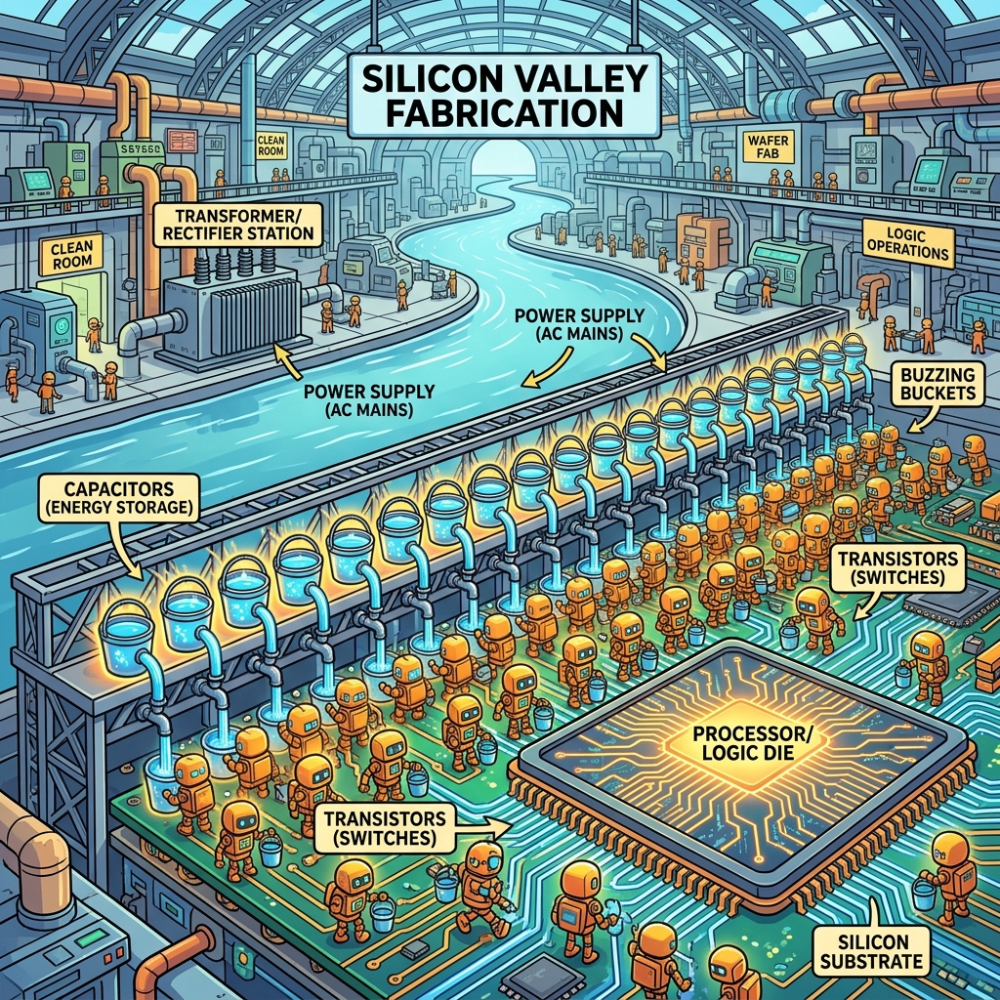
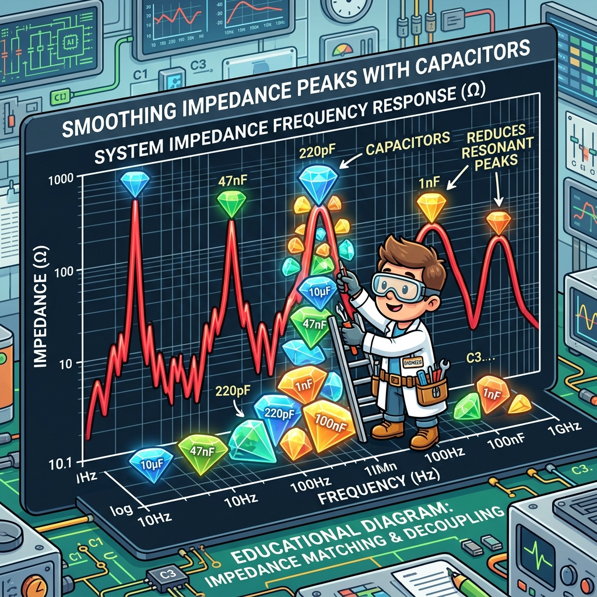

# Section 1.2: Avoid the Magic Smoke: Power Planning and System Dependencies

You've got your board layout roughly sketched out, and you're feeling good. But before you get too comfortable, we need to talk about the lifeblood of your FPGA: Power. These chips aren't like your TV remote that runs on a couple of AA batteries for three years. An AMD UltraScale+ device can pull enough current to weld a car door shut if you aren't careful.

If you don't plan your power delivery network (PDN) correctly, you’ll encounter the dreaded "Magic Smoke." That’s the gray cloud that escapes from your chip when it realizes your power supply is about as stable as a caffeinated toddler. Once the smoke is out, you can't put it back in. Let’s make sure it stays inside where it belongs.

### The Estimation Game: No Guessing Allowed

Before you even buy a single voltage regulator, you need to know how much juice your design is going to drink. This is where the Xilinx Power Estimator (XPE) comes in. It’s a specialized spreadsheet that feels like a trip to a fortune teller, except with more math and fewer crystal balls.

You plug in your resource counts—how many LUTs, how many DSP slices, how fast your clocks are running—and XPE spits out a number. That number is usually much higher than you expect. If you build a 5-amp supply for a design that actually needs 15 amps, your board will shut down the moment you try to run your first heavy workload. Estimation isn't optional; it's a survival skill.

> **Brain Power**
> **If your core voltage ($V_{CCINT}$) is 0.85V and your design draws 20A, how much power is being dissipated as heat in that tiny piece of silicon? Now, consider the size of that chip. Is that power density higher or lower than a typical kitchen stovetop element? Think about the cooling implications.**

### The Decoupling Dance: Tiny Reservoirs

Inside your FPGA, millions of transistors are switching on and off at gigahertz speeds. Every time they switch, they demand a tiny burst of current. If your power supply is across the board, the inductance of the traces will prevent that current from arriving fast enough. The result? Your voltage dips, your logic glitches, and your design crashes.

This is why we use decoupling capacitors. Think of them as tiny local reservoirs of energy sitting right next to the chip. When the transistors need a drink, they take it from the nearest capacitor. Then, the power supply refilled the capacitor at a more leisurely pace. Without a proper mix of ceramic and tantalum capacitors, your power rails will look like a stormy sea on an oscilloscope.



### Fireside Chat: The Regulator and the Logic

**Voltage Regulator:** "I'm giving you exactly 0.85 volts! Why are you still complaining?"

**Internal Logic:** "Exactly? You call that exactly? Every time I start my 512-bit multiplier, I see a 50-millivolt drop. That’s enough to make my timing margins evaporate!"

**Voltage Regulator:** "Hey, I'm trying! But I'm three inches away. By the time I see your voltage drop and react, the party's already over."

**Internal Logic:** "Then tell the Capacitors to wake up! They’re supposed to handle the fast stuff. If they don't hold the line, I'm going to start flipping bits at random just to spite you."

### Sequencing: Don't Put Your Shoes on Before Your Pants

An FPGA doesn't just have one power rail. It has dozens. You’ve got $V_{CCINT}$ for the core, $V_{CCAUX}$ for auxiliary logic, $V_{CCO}$ for the I/O banks, and specialized rails for transceivers. And here’s the kicker: they have to be turned on in a very specific order.

If you turn on the I/O rails before the core logic is ready, you can create "latch-up" conditions where the chip tries to power itself through the input pins. This is a great way to turn your expensive FPGA into a very fancy space heater. Power sequencing is the choreography of the board's startup. You need a dedicated power management IC (PMIC) or a sequencer to ensure everyone wakes up in the right order.

### The Analogy: The City Water System

Think of your power delivery as a city's water system. The main water tower is your switching power supply. It provides the bulk pressure. The pipes running through the streets are your PCB planes. But if everyone in the city flushes their toilet at exactly the same time, the pressure in the pipes drops.

To prevent this, big buildings have their own local water tanks on the roof. Those are your decoupling capacitors. They ensure that when you turn on the tap, you get a steady stream regardless of what's happening elsewhere in the city. If the water pressure isn't steady, your dishwasher (the FPGA logic) won't run correctly and might even get damaged.

### The Technical Reality: PDN Impedance

In the professional world, we don't just "throw some caps at it." We design the Power Delivery Network (PDN) to have a low impedance over a wide range of frequencies. A capacitor isn't just a capacitor; at high frequencies, its internal inductance makes it stop working.

This is why you see a mix of values—100nF, 1uF, 10uF. Each one handles a different frequency range. You want the overall impedance of your power rails to stay below a "target impedance" from DC all the way up to hundreds of megahertz. If you have an impedance "spike" at 50MHz, and your logic happens to switch at that frequency, you’ll generate massive amounts of noise that will haunt your dreams.



### Code Detective: The SYSMON Reader

AMD FPGAs have a built-in "System Monitor" (SYSMON) that can measure internal temperatures and voltage levels. It’s like a dashboard for your chip. But if your code for reading it is buggy, you might think everything is fine while the chip is actually cooking itself.

```python
# Code Detective: Why is this monitoring script dangerous?
def check_fpga_health(sensor_data):
    # Assuming sensor_data is a dictionary from the AXI SYSMON interface
    temp = sensor_data.get('temp_celsius', 0)
    vccint = sensor_data.get('vccint_volts', 0.85)

    if temp > 100:
        print("CRITICAL: FPGA is too hot! Shutting down logic...")
        trigger_logic_reset()
    
    if vccint < 0.80:
        print("WARNING: Voltage sag detected. Performance may be degraded.")

# Hint: What happens if 'sensor_data' is empty or the interface is stuck?
```

The flaw here is the "default" values in the `.get()` method. If the SYSMON interface fails or returns an empty dictionary, the script will report a perfectly safe temperature of 0°C and a standard voltage of 0.85V. Your monitoring system will be happily telling you "All Clear!" while the silicon is literally bubbling on the board. A robust system should fail-safe, assuming the worst if data is missing.

**The fix.** Absent data is an alarm condition, not a default. Also range-check the
reading: SYSMON returns a 16-bit code, and a stuck bus reads as all-zeros or all-ones,
both of which decode to numbers that are *in range* for a naive conversion.

```python
# Corrected: missing or implausible data escalates instead of reassuring.
SYSMON_TEMP_VALID_C  = (-40.0, 125.0)   # device operating range, not "reasonable"
SYSMON_VCCINT_VALID  = (0.60, 1.00)     # VCCINT nominal 0.85 V +/- generous margin

class SysmonFault(Exception):
    """Raised when the monitor itself cannot be trusted."""

def read_health(sensor_data):
    for key, (lo, hi) in (("temp_celsius", SYSMON_TEMP_VALID_C),
                          ("vccint_volts", SYSMON_VCCINT_VALID)):
        if key not in sensor_data:
            raise SysmonFault(f"{key} absent - SYSMON link is down")
        value = sensor_data[key]
        if not lo <= value <= hi:
            raise SysmonFault(f"{key}={value} outside {lo}..{hi} - stuck bus or bad decode")
    return sensor_data["temp_celsius"], sensor_data["vccint_volts"]

def check_fpga_health(sensor_data):
    try:
        temp, vccint = read_health(sensor_data)
    except SysmonFault as fault:
        # Cannot see the die: assume the worst and throttle. Do NOT return "ok".
        enter_safe_mode(reason=str(fault))
        return "UNKNOWN"

    if temp > 100.0:
        enter_safe_mode(reason=f"Tj {temp} C over limit")
        return "CRITICAL"
    if vccint < 0.80:
        return "DEGRADED"        # rail sagging: log it, timing margin is gone
    return "OK"
```

The rule generalises well beyond SYSMON: **a health monitor that cannot distinguish
"healthy" from "not answering" is not a health monitor.**

### Dependencies: The Supporting Cast

Your FPGA isn't an island. It depends on external components like clocks and reset controllers. If your clock chip has too much "jitter" (tiny variations in timing), your high-speed transceivers won't be able to lock onto a signal. Power supply noise is often the primary cause of clock jitter.

Similarly, your reset signal needs to be "clean." If the reset line bounces or has noise on it, your FPGA might partially reset, leaving the design in a "zombie" state where some parts are running and others are frozen. This is why power planning includes filtering for the auxiliary components that keep the FPGA sane. Clean power isn't just about the chip; it's about the entire ecosystem.

### Analogy → Silicon

| In the story | In the silicon / on the board | Where the analogy breaks |
| --- | --- | --- |
| Water tower | The switching regulator (or PMIC channel) feeding a rail | A tower's pressure is set by height alone; a regulator's usable "pressure" rolls off above its control-loop bandwidth, typically tens of kHz to a few hundred kHz |
| Rooftop tanks on each building | Decoupling capacitors, chosen per frequency band | Tanks only ever help; a capacitor has series inductance (ESL) and becomes an *inductor* above its self-resonant frequency, where it stops helping entirely |
| Everyone flushing at once | Simultaneous switching current, $\mathrm{d}i/\mathrm{d}t$ at a clock edge | Plumbing demand is uncorrelated; FPGA demand is perfectly correlated to the clock edge, which is why the transient is a step and not a ramp |
| Caffeinated toddler | Rail ripple and droop under load steps | A toddler is unpredictable; droop is deterministic and computable from PDN impedance $\times$ current step |
| Shoes before pants | Power-on sequencing across $V_{CCINT}$, $V_{CCAUX}$, $V_{CCO}$, $V_{CCBRAM}$ | Getting dressed wrong is embarrassing; wrong sequencing forward-biases ESD structures and can latch up the die permanently |

### Do the Math

The one number that turns "throw some caps at it" into engineering is **PDN target
impedance**. It is the impedance your power delivery network must stay below, across
frequency, so that the worst current step does not move the rail more than your ripple
budget allows.

$$Z_{\text{target}} = \frac{V_{\text{rail}} \times \text{ripple budget}}{\Delta I_{\text{transient}}}$$

**Givens** (take yours from the datasheet's recommended operating conditions and from
XPE, not from this table):

| Symbol | Meaning | Value |
| --- | --- | --- |
| $V_{\text{rail}}$ | $V_{CCINT}$ nominal | 0.85 V |
| ripple | Allowed total rail deviation | 3 % |
| $\Delta I$ | Worst-case transient step (assume half the 20 A steady draw switches in one event) | 10 A |

$$Z_{\text{target}} = \frac{0.85\ \text{V} \times 0.03}{10\ \text{A}} = \frac{0.0255\ \text{V}}{10\ \text{A}} = 2.55\ \text{m}\Omega$$

**2.55 milliohms.** That is the entire budget — regulator output impedance, plane
spreading inductance, capacitor ESR/ESL, and via inductance, all in parallel, from DC to
the frequency where the die's own on-package capacitance takes over.

Now see why one capacitor value is never enough. A capacitor's impedance is
$|Z| = \sqrt{ESR^2 + (2\pi f L_{ESL} - 1/(2\pi f C))^2}$, and it is minimised at its
self-resonant frequency $f_{SRF} = 1 / (2\pi\sqrt{L_{ESL} C})$. For a 100 nF 0402 with
roughly 0.8 nH of mounted inductance:

$$f_{SRF} = \frac{1}{2\pi\sqrt{0.8\times10^{-9} \times 100\times10^{-9}}} = \frac{1}{2\pi \times 8.94\times10^{-9}} \approx 17.8\ \text{MHz}$$

Above ~18 MHz that capacitor is an inductor. Its impedance at 100 MHz is roughly
$2\pi f L = 2\pi \times 10^8 \times 0.8\times10^{-9} \approx 0.50\ \Omega$ — nearly 200
times your budget. **One part does not cover the band; $N$ parts in parallel divide the
inductance by $N$.** To hit 2.55 mΩ at 100 MHz from ESL alone you need

$$N = \frac{0.50\ \Omega}{0.00255\ \Omega} \approx 196 \text{ capacitors}$$

which is exactly why the underside of a large FPGA looks the way it does, and why
mounting inductance (short, fat, via-in-pad connections) matters more than the
capacitance value printed on the part.

**Verdict:** the deliverable from power planning is not "a decoupling scheme," it is a
plot of $|Z_{PDN}(f)|$ that stays under a computed line. Everything else is decoration.

### The Real Artifact

Voltage and temperature are not board-bringup-only concerns — they change your timing.
Here is a synthesizable SYSMON wrapper that produces the two signals a real system
needs: a *sticky* alarm the software can read, and an immediate throttle that does not
wait for a bus transaction.

```systemverilog
// sysmon_guard.sv
//
// UltraScale+ SYSMONE4 wrapper. Two behaviours worth copying:
//   1. Alarms are sticky - a 200 us over-temperature excursion at 3am must still be
//      visible at 9am. Live status alone loses the event that killed you.
//   2. The throttle path is combinational off the hard block's own alarm output,
//      so it does not depend on the DRP state machine (or on software) being alive.
//
// DRP address map (UG580): 0x00 = temperature, 0x01 = VCCINT, 0x02 = VCCAUX.
// Temperature transfer function, UltraScale on-chip sensor:
//   Tj[C] = (ADC_code * 501.3743 / 65536) - 273.6777
// The INIT_* values below are illustrative. Generate the real ones with the System
// Management Wizard for your device, sequence and alarm thresholds - hand-computed
// INIT words are a classic source of "the alarm never fires" bugs.

module sysmon_guard #(
    parameter real TEMP_WARN_C = 85.0,
    parameter real TEMP_CRIT_C = 100.0
) (
    input  logic        clk,           // DRP clock, <= 250 MHz
    input  logic        rst_n,
    output logic [15:0] temp_code,     // raw ADC, for host telemetry
    output logic        warn,          // sticky: crossed TEMP_WARN_C at least once
    output logic        crit,          // sticky: crossed TEMP_CRIT_C at least once
    output logic        throttle       // live, hard-block sourced, no clock dependency
);

    // Convert the thresholds to raw codes at elaboration time: comparing integers in
    // fabric is one carry chain, comparing reals is not synthesizable.
    localparam logic [15:0] WARN_CODE =
        int'((TEMP_WARN_C + 273.6777) * 65536.0 / 501.3743);
    localparam logic [15:0] CRIT_CODE =
        int'((TEMP_CRIT_C + 273.6777) * 65536.0 / 501.3743);

    logic        drp_den, drp_drdy;
    logic [15:0] drp_do;
    logic [15:0] alm;                 // SYSMONE4 alarm bus, one bit per channel
    logic        ot_alarm;
    wire         user_temp_alarm = alm[0];   // ALM[0] = user temperature

    // --- continuous DRP poll of the temperature register -------------------------
    logic [9:0] poll_div;
    always_ff @(posedge clk) begin
        if (!rst_n) begin
            poll_div <= '0;
            drp_den  <= 1'b0;
        end else begin
            poll_div <= poll_div + 1'b1;
            drp_den  <= (poll_div == '0);   // one read per 1024 clocks
        end
    end

    always_ff @(posedge clk) begin
        if (!rst_n)          temp_code <= '0;
        else if (drp_drdy)   temp_code <= drp_do;
    end

    // --- sticky alarms ------------------------------------------------------------
    always_ff @(posedge clk) begin
        if (!rst_n) begin
            warn <= 1'b0;
            crit <= 1'b0;
        end else begin
            if (temp_code >= WARN_CODE) warn <= 1'b1;
            if (temp_code >= CRIT_CODE) crit <= 1'b1;
        end
    end

    // The hard block asserts OT independently of this state machine. Route it out
    // combinationally so a wedged DRP poll cannot mask a real over-temperature.
    assign throttle = ot_alarm | user_temp_alarm;

    SYSMONE4 #(
        .INIT_40 (16'h3000),   // averaging: 16 samples
        .INIT_41 (16'h20F0),   // continuous sequence mode, ALARM enables
        .INIT_42 (16'h0400),   // DRP clock divider
        .INIT_48 (16'h0700),   // sequence: temperature, VCCINT, VCCAUX
        .INIT_4C (16'hAE4E),   // user temp alarm lower (~85 C) - see UG580 Table 3-1
        .INIT_50 (16'hB794)    // OT limit (~125 C)
    ) u_sysmon (
        .DCLK    (clk),
        .DEN     (drp_den),
        .DWE     (1'b0),
        .DADDR   (8'h00),
        .DI      (16'h0000),
        .DO      (drp_do),
        .DRDY    (drp_drdy),
        .OT      (ot_alarm),
        .ALM     (alm),
        .RESET   (~rst_n),
        .VP      (1'b0),
        .VN      (1'b0)
    );

endmodule
```

Two things to steal from this even if you never instantiate SYSMON: sticky alarms, and
a safety path that does not depend on the thing it is protecting.

### Sharpen Your Pencil

1. Your design runs on $V_{CCINT} = 0.72$ V (a low-voltage-capable device), draws 35 A,
   and your rail spec allows 2 % ripple. Compute $Z_{\text{target}}$. Is the budget
   easier or harder than the 0.85 V / 20 A case, and by what factor?
2. You have 1 µF 0402 parts with 0.7 nH mounted inductance. What is their
   self-resonant frequency, and are they useful at 50 MHz?
3. XPE tells you $V_{CCINT}$ draws 18.4 A and $V_{CCBRAM}$ draws 2.1 A. Your regulator
   vendor offers a 20 A module. Name two reasons "20 A ≥ 18.4 A" is the wrong way to
   pick it.

### Monitoring for the Long Haul

Finally, remember that power issues can be cumulative. A rail that is "mostly stable" might cause tiny amounts of damage over months of operation through a process called electromigration. This is where high current density literally pushes atoms of metal out of place, eventually causing a permanent short or open circuit.

By using the SYSMON and keeping an eye on your power rails during development, you can catch these issues before they become permanent failures. Treat your power rails with respect, and they will give your FPGA a long, happy life. Ignore them, and you’ll find out exactly how much a replacement Alveo card costs—and your boss won't be happy about the bill.

### Answers

**Brain Power** — *0.85 V core, 20 A draw: how much heat, and how does the power density
compare to a stovetop element?*

$$P = V \times I = 0.85\ \text{V} \times 20\ \text{A} = 17\ \text{W}$$

Now the density, which is the part that matters. Take a large UltraScale+ die at roughly
$25\ \text{mm} \times 25\ \text{mm} = 625\ \text{mm}^2 = 6.25\ \text{cm}^2$:

$$\frac{17\ \text{W}}{6.25\ \text{cm}^2} = 2.7\ \text{W/cm}^2$$

A 2 kW stovetop element of about 18 cm diameter spreads its power over
$\pi \times 9^2 \approx 254\ \text{cm}^2$, giving $2000/254 \approx 7.9\ \text{W/cm}^2$.
So the FPGA is roughly a third of a stovetop element — the same order of magnitude, from
a part with no glowing coil and a 100 °C limit instead of 500 °C. And that is the *quiet*
case: an HBM-class device at 70 W in the same area lands at 11 W/cm², past the stovetop.

This is why Chapter 5 exists, and why the cooling solution has to be chosen during board
planning rather than discovered afterwards.

**Sharpen Your Pencil #1** —

$$Z_{\text{target}} = \frac{0.72\ \text{V} \times 0.02}{35\ \text{A}} = \frac{0.0144\ \text{V}}{35\ \text{A}} = 0.41\ \text{m}\Omega$$

Against the 2.55 mΩ from the worked example, the budget is **6.2× harder**. Note where
that came from: lowering the rail voltage shrinks the numerator *and* the higher current
grows the denominator, so voltage scaling for power savings tightens PDN design at both
ends. Low-voltage operation is not free — you pay for it in copper, capacitor count, and
regulator sense accuracy.

**Sharpen Your Pencil #2** —

$$f_{SRF} = \frac{1}{2\pi\sqrt{L C}} = \frac{1}{2\pi\sqrt{0.7\times10^{-9} \times 1\times10^{-6}}} = \frac{1}{2\pi \times 2.65\times10^{-8}} \approx 6.0\ \text{MHz}$$

At 50 MHz the part is well past resonance and behaving as an inductor:
$|Z| \approx 2\pi \times 50\times10^6 \times 0.7\times10^{-9} \approx 0.22\ \Omega$.
So: useful in the 1–10 MHz band, useless as a 50 MHz decoupler. Note the impedance above
resonance depends only on $L$, not on $C$ — which is why swapping a 1 µF for a 10 µF in
the same package changes nothing at high frequency, and why the fix is *more parts* or
*lower-inductance mounting*, never a bigger number.

**Sharpen Your Pencil #3** — two of several good reasons:

1. **XPE is an estimate with a stated confidence, not a measurement.** Early in a
   project its inputs (toggle rates, resource counts) are guesses. Sizing a 20 A
   regulator to an 18.4 A estimate leaves 8 % margin against a number that can easily
   move 20 %. Re-run `report_power` on the routed design with a SAIF from simulation
   before you commit the BOM.
2. **The steady-state number is not the transient number.** The regulator also has to
   survive the load *step* — the difference between idle and full DSP activity, arriving
   in one clock edge. That is what sets your output capacitance and the control-loop
   response, and it is the number that produces droop-induced timing failures rather
   than a shutdown.

A third, if you want it: derating. A "20 A" module is 20 A at 25 °C ambient with
specified airflow. Inside your chassis at 55 °C it may be a 14 A module.

### There Are No Dumb Questions

**Q: If the PDN impedance is that hard, how does anything ever work?**

A: Because the die helps. There is on-package and on-die capacitance sitting inside the
package, with almost no series inductance, and it covers the highest frequencies where
board-level capacitors have long since given up. Your board's job is DC to roughly
100 MHz; above that you physically cannot reach the die through package inductance, and
you are not meant to. Knowing where your responsibility ends is half of PDN design.

**Q: Can I just simulate the PDN instead of doing this arithmetic?**

A: You should do both, in that order. The hand calculation gives you the target line and
tells you roughly how many parts you need, in about five minutes, before layout starts.
The 3D field solve tells you where the plane resonances are and whether your via
placement threw away the parts you paid for. The simulation without the target is a
picture with no pass/fail criterion.

**Q: Which rail should I worry about first?**

A: $V_{CCINT}$, because it carries the most current at the lowest voltage — the worst
possible combination for target impedance. But do not ignore $V_{CCO}$: I/O banks switch
large currents into external loads with fast edges, and $V_{CCO}$ noise shows up directly
as output jitter and as SSN on neighbouring pins. `report_ssn` exists to quantify that.

**Q: My board works fine on the bench. Do I really need the sticky alarms?**

A: The bench is the one environment you have already proven. Sticky alarms exist for the
other ones. A thermal or rail excursion lasting 200 µs is invisible to polled telemetry
and entirely capable of corrupting state; without a latched bit, your field-returned
board reports "no fault found" and comes straight back to you.

### Bullet Points

- **Target impedance**: $Z_{\text{target}} = V_{\text{rail}} \times \text{ripple} / \Delta I$.
  Compute it before choosing a single component.
- 0.85 V, 3 %, 10 A step → **2.55 mΩ**. Lowering the rail voltage makes the budget
  *harder*, not easier.
- **Capacitor self-resonance**: $f_{SRF} = 1/(2\pi\sqrt{L_{ESL}C})$. Above it, only
  inductance matters — parallel more parts, shorten the mounting, stop increasing
  capacitance.
- **Sequencing** is a hard requirement, not a preference. Get the order and the ramp
  timing from the device datasheet, and enforce it with a sequencer or PMIC.
- **Estimate, then measure**: XPE during planning → `report_power` on the routed design →
  `report_power -advisory` for what to fix. Feed it a SAIF from simulation or the
  confidence stays "Low".
- **SYSMON transfer function** (UltraScale):
  $T_j = (\text{code} \times 501.3743 / 65536) - 273.6777$ °C.
- **Health-monitor rule**: absent data must escalate. A monitor that reports "OK" when
  its link is down is worse than no monitor.
- **Commands**: `report_power`, `report_power -advisory`, `report_ssn`,
  `report_property [get_iobanks <n>]`.

---
[REVIEW_STATUS: APPROVED BY PUBLISHER]