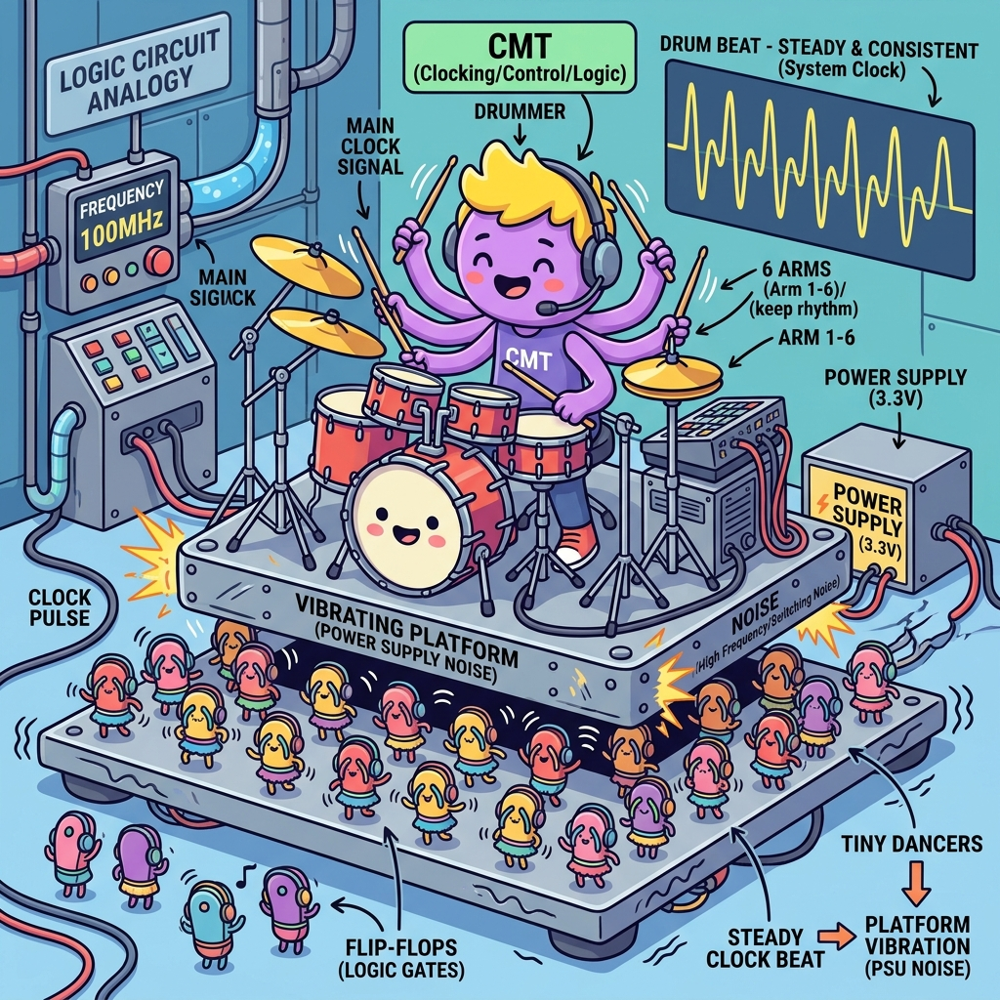

# Section 1.3: The Heartbeat: Clock Resource Planning and Why You Can't Wing It

Imagine a massive orchestra with thousands of musicians. Now, imagine if every musician decided to play at their own tempo. You wouldn't get a symphony; you'd get a headache. In an FPGA, every flip-flop is a musician, and the clock is the conductor’s baton. If that baton doesn't reach everyone at exactly the right time, your "hardware symphony" turns into a chaotic mess of glitches.

Clocking is the most critical resource in your design. You can have the fastest logic in the world, but if your clock distribution is sloppy, your design will crawl—or worse, it will work on one chip and fail on another. In the AMD UltraFast world, we don't just "connect a clock." We plan the heartbeat of the system with surgical precision.

### The Buffer Buffet: Choosing Your Weapon

In a standard PCB, you might just run a trace from a clock chip to a pin. But inside an FPGA, a single clock signal might need to reach 100,000 different flip-flops. If you tried to do that with a regular wire, the signal would be so weak and slow by the time it reached the last flip-flop that the first one would already be onto the next cycle.

This is why we use Clock Buffers. These are specialized high-speed amplifiers built into the FPGA's routing fabric. On **UltraScale and UltraScale+** the ones you will actually instantiate are:

| Primitive | What it does | Use it when |
| --- | --- | --- |
| `BUFGCE` | Global clock buffer with a glitchless enable | The default. Nearly every clock in your design. |
| `BUFGCE_DIV` | `BUFGCE` plus an integer divider (÷1 to ÷8) | You need a slower, *phase-aligned* version of a clock without spending an MMCM output |
| `BUFGCTRL` | Glitchless mux between two clock sources | Runtime clock switching (redundant reference, test mode) |
| `BUFG_GT` | Buffer for transceiver-sourced clocks, with divider | Anything clocked from a GT `TXOUTCLK`/`RXOUTCLK` |

> **Careful here.** If you have read 7-series material, you will have met `BUFR`, `BUFH`
> and `BUFIO`. **Those primitives do not exist in UltraScale or UltraScale+.** Regional
> clocking is no longer a different *buffer*; it is the same `BUFGCE` whose reach is
> determined by which clock regions its loads land in. You get the "regional" benefit by
> constraining placement, not by picking a different cell. Porting a 7-series clocking
> scheme by search-and-replace is a reliable way to spend a week.

> **Brain Power**
> **Your design occupies a single SLR of a multi-die device, and you have a clock driving 40,000 flip-flops inside it. You instantiate one `BUFGCE`. What determines whether that clock stays inside one SLR or spans all three — and what does it cost you if it spans them?**

### Regional vs. Global: Keeping it Local

FPGAs are huge. In the latest AMD devices, a signal can take several nanoseconds just to travel from the bottom left corner to the top right. If your clock has to make that journey, it’s going to arrive late. This "clock skew" is the enemy of high-speed design.

A `BUFGCE` whose loads are scattered across every clock region on the die drives a much larger clock tree than one whose loads sit in four adjacent regions: more leaf drivers toggling, more capacitance, more insertion delay, and more skew between the near and far corners. On UltraScale+ you do not choose a "regional buffer" to fix that — you constrain *where the loads go*, and the clock tree shrinks to match. If your design is modular, keeping each clock's loads in a compact set of clock regions saves you a world of timing-closure pain later on.


### Fireside Chat: The Global Buffer and the Local Router

**Global Buffer (BUFG):** "I am the King of Time! I can reach any flip-flop on this entire 2-million-LUT die. Nothing happens without my permission."

**Local Router:** "Yeah, and you're also slow. By the time your edge reaches the far corner, my local clock has already finished the task and is headed to lunch. You're a power-hog, King."

**Global Buffer:** "Power is the price of total synchronization! I ensure that every register, from the PCIe block to the GPIO, sees the same edge at the same time. You’re just a small-town manager."

**Local Router:** "Small-town? I’m efficient! I keep my skew low and my frequency high. If I tried to wait for you, I’d never hit 500MHz. Some of us actually have work to do."

### The CMT: The Clock Management Tile

Sometimes, the clock you have isn't the clock you need. Maybe your oscillator gives you 100MHz, but your memory controller needs 400MHz, and your display driver needs 74.25MHz. You can’t just buy a hundred different oscillators. This is where the Clock Management Tile (CMT) comes in.

Inside every CMT, you’ll find an MMCM (Mixed-Mode Clock Manager) and a PLL (Phase-Locked Loop). These are the "Swiss Army Knives" of timing. They can multiply your clock, divide it, and even shift its phase by a few picoseconds. They are also incredibly good at "cleaning" a noisy clock, removing jitter so your logic doesn't get confused.

### The Analogy: The Subway System

Think of your FPGA’s clocking as a city’s subway system. The `BUFG` is the express train that goes to every single station in the city. It’s reliable, but it takes a while to get from end to end. The `BUFR` is the local shuttle that only runs within one borough. It’s much faster because it has a smaller route.

The Clock Management Tile is the central station where all the lines meet. It takes the incoming train (the primary clock) and decides how to split it up. It can speed up the frequency of trains for the busy business district or slow them down for the quiet residential areas. If the central station is disorganized, the entire city grinds to a halt.

### The Technical Deep Dive: Clock Skew and Jitter

Let’s talk about the two villains of clocking: Skew and Jitter. Skew is a spatial problem—it’s the difference in time it takes for the clock to reach Point A versus Point B. If the skew is too large, Point B might think it’s still in the previous clock cycle when Point A has already moved on. This leads to "hold time" violations, which are the hardest bugs to fix.

Jitter is a temporal problem—it’s the uncertainty in when the next clock edge will actually arrive. It’s like a drummer who can’t quite keep a steady beat. High jitter reduces your "setup time" margin, effectively making your 200MHz design act like a 220MHz design on its bad days. AMD’s UltraFast methodology emphasizes using dedicated clocking resources to minimize both of these.



### Code Detective: The Clock Constraint

In Vivado, you have to tell the tool exactly what your clocks are doing. If you lie to the tool, it will happily "pass" your design, and then it will fail in the real world. Check out this common constraint mistake:

```tcl
# Code Detective: Why is this 'create_clock' command dangerous?
create_clock -period 5.000 -name sys_clk [get_pins my_pll/CLKOUT0]

# Hint: Is the input to the PLL already constrained? 
# And should you be defining a primary clock on an internal pin?
```

The logic flaw here is that `create_clock` should generally only be used on **input ports** (the physical pins where the clock enters the FPGA). Defining a primary clock on an MMCM output tells Vivado "this clock has no source" — it stops tracing the arc back through the MMCM, so it no longer knows the input and output are related, no longer accounts for the MMCM's insertion delay, and will happily analyse paths between `sys_clk` and its own parent as if they were unrelated asynchronous domains.

**The fix.** Constrain the *port*, and let Vivado derive the rest:

```tcl
# Corrected: one primary clock, on the pin where the clock physically enters.
create_clock -period 10.000 -name sys_clk_p [get_ports sys_clk_p]

# Vivado automatically creates generated clocks on MMCM/PLL outputs from the
# CLKOUT*_DIVIDE / CLKFBOUT_MULT_F properties of the instance. You do NOT need to
# write create_generated_clock for them - but you do need to know their auto-derived
# names before you can reference them:
report_clocks

# Only write create_generated_clock by hand for things Vivado cannot see through,
# such as a clock divider you built in fabric:
create_generated_clock -name clk_div4 \
    -source [get_pins clk_div_reg[1]/C] -divide_by 4 \
    [get_pins clk_div_reg[1]/Q]
```

Note the difference in intent. `create_clock` asserts *"a clock arrives here, and here is
its period."* `create_generated_clock` asserts *"this clock is derived from that one, by
this ratio"* — which is what preserves the timing arc, and therefore what lets Vivado
compute real skew between the two domains instead of guessing.

### Clock Regions: Know Your Neighborhood

Modern AMD FPGAs are divided into physical "Clock Regions." Each region has its own set of local buffers and routing tracks. If you try to cross too many regional boundaries with a local clock, you’ll run out of tracks or introduce massive amounts of delay.

When planning your design, you should try to keep related logic within the same or adjacent clock regions. This is called "floorplanning." By placing your high-speed memory controller right next to the I/O pins it controls and using a regional clock, you ensure the shortest possible paths and the best possible timing margins. Don't just let the tools "figure it out"—give them a helping hand by planning your neighborhoods.

### Analogy → Silicon

| In the story | In the silicon | Where the analogy breaks |
| --- | --- | --- |
| Conductor's baton | The clock tree driven by a `BUFGCE` | A baton reaches everyone at the speed of sight; a clock tree has real insertion delay, and the tool *budgets* for the difference rather than eliminating it |
| Express train to every station | A `BUFGCE` whose loads span many clock regions | Trains cost per journey; a wide clock tree burns dynamic power on every edge whether or not any data moves |
| Local shuttle in one borough | The **same** `BUFGCE` with its loads constrained to a few clock regions | There is no separate "local buffer" primitive in UltraScale+ — this is placement, not instantiation. The 7-series `BUFR`/`BUFH` mental model does not port. |
| Central station splitting lines | `MMCME4_ADV` / `PLLE4_ADV` — multiply, divide, phase shift | A station can add trains; an MMCM can only produce frequencies of the form $F_{in} \cdot M / (D \cdot O)$, and only if the VCO lands in its legal band |
| Drummer who can't keep a beat | Jitter, which Vivado folds into **clock uncertainty** | A bad drummer is audible; jitter is invisible until it eats your setup margin, and you see it only as a smaller number in the timing report |
| Two photographers, one further away | Clock **skew** between launch and capture flops | Photographers can be repositioned freely; skew is set by the physical tree and you influence it only through placement and buffer choice |

### Do the Math

An MMCM is not a wish-granting device. It produces output frequencies of exactly one form:

$$F_{VCO} = F_{IN} \times \frac{M}{D}, \qquad F_{OUT_i} = \frac{F_{VCO}}{O_i}$$

where $M$ is `CLKFBOUT_MULT_F`, $D$ is `DIVCLK_DIVIDE`, and $O_i$ is `CLKOUT{i}_DIVIDE`.
The whole design problem is: **find one $F_{VCO}$ inside the legal band that divides
evenly into every output you need.**

**Givens** (VCO limits are device and speed-grade specific — read yours out of the
datasheet; these are for the sake of the example):

| Symbol | Meaning | Value |
| --- | --- | --- |
| $F_{IN}$ | Board oscillator | 100 MHz |
| $F_{VCO}$ range | Assume UltraScale+ -2 | 800 MHz to 1600 MHz |
| Required outputs | Ethernet, DSP, control | 156.25 MHz, 312.5 MHz, 125 MHz |

**Step 1 — find a VCO that serves all three.** Try $D = 1$, $M = 12.5$:

$$F_{VCO} = 100\ \text{MHz} \times \frac{12.5}{1} = 1250\ \text{MHz} \quad \checkmark \text{ (inside 800–1600 MHz)}$$

**Step 2 — solve for each output divider.**

$$O_{0} = \frac{1250}{312.5} = 4, \qquad O_{1} = \frac{1250}{156.25} = 8, \qquad O_{2} = \frac{1250}{125} = 10$$

All three are integers. That is the answer: one MMCM, `DIVCLK_DIVIDE = 1`,
`CLKFBOUT_MULT_F = 12.5`, and output divides of 4, 8 and 10. No fractional divider, no
second MMCM, no cascade.

**Step 3 — check what you would have paid for guessing.** Suppose you had reached for
$M = 10$, $D = 1$ giving $F_{VCO} = 1000$ MHz. Then:

$$O = \frac{1000}{156.25} = 6.4$$

Not an integer. Only `CLKOUT0` supports a fractional divide, so you would have burned
your one fractional output on Ethernet, or cascaded a second MMCM — which adds its own
insertion delay and its own jitter, on the clock that feeds your most timing-critical
interface. **A five-minute arithmetic check at planning time removes a component from
the design.**

**Step 4 — what it costs you in timing.** The MMCM's output jitter does not vanish; it
appears as clock uncertainty subtracted from every setup path on that domain. Check what
the tool actually applied:

```tcl
report_timing -of_objects [get_timing_paths -max_paths 1 -to [get_clocks clk_156]] \
              -input_pins -rpx uncertainty.rpx
```

and read the `clock uncertainty` line of the path report. If it is a meaningful fraction
of your period, cascaded MMCMs and noisy $V_{CCAUX}$ are the first two places to look.

### The Real Artifact

A complete, correct clocking front end for the numbers computed above — instantiation
plus the constraints that make it analysable.

```systemverilog
// clk_gen.sv - 100 MHz differential reference in; 312.5 / 156.25 / 125 MHz out.
//
// Computed in "Do the Math": DIVCLK_DIVIDE=1, CLKFBOUT_MULT_F=12.5 => VCO 1250 MHz,
// output divides 4, 8, 10. Verify the VCO band against your device's datasheet.
//
// Two details that are easy to get wrong and expensive to debug:
//   * The feedback path must go through a BUFG-class buffer if the output clocks do,
//     so that the MMCM compensates for the buffer's insertion delay.
//   * LOCKED is asynchronous. It must be synchronized into each output domain before
//     it is allowed to release a reset. Using LOCKED directly as a reset is the
//     single most common cause of "works on the bench, fails at cold start".

module clk_gen (
    input  logic sys_clk_p,
    input  logic sys_clk_n,
    output logic clk_312,
    output logic clk_156,
    output logic clk_125,
    output logic rst_312_n,
    output logic rst_156_n,
    output logic rst_125_n
);

    logic ref_clk, fb_out, fb_in;
    logic clk_312_i, clk_156_i, clk_125_i;
    logic locked;
    logic rst_312, rst_156, rst_125;

    IBUFDS u_ibufds (.I(sys_clk_p), .IB(sys_clk_n), .O(ref_clk));

    MMCME4_BASE #(
        .CLKIN1_PERIOD   (10.000),   // 100 MHz
        .DIVCLK_DIVIDE   (1),        // D
        .CLKFBOUT_MULT_F (12.500),   // M  -> VCO = 100 * 12.5 / 1 = 1250 MHz
        .CLKOUT0_DIVIDE_F(4.000),    // 1250 / 4  = 312.50 MHz
        .CLKOUT1_DIVIDE  (8),        // 1250 / 8  = 156.25 MHz
        .CLKOUT2_DIVIDE  (10)        // 1250 / 10 = 125.00 MHz
    ) u_mmcm (
        .CLKIN1   (ref_clk),
        .CLKFBIN  (fb_in),
        .CLKFBOUT (fb_out),
        .CLKOUT0  (clk_312_i),
        .CLKOUT1  (clk_156_i),
        .CLKOUT2  (clk_125_i),
        .LOCKED   (locked),
        .PWRDWN   (1'b0),
        .RST      (1'b0)
    );

    // Feedback through a global buffer: this is what makes the MMCM cancel the
    // clock tree's insertion delay instead of adding to it.
    BUFG u_fb  (.I(fb_out),    .O(fb_in));

    BUFGCE u_b312 (.I(clk_312_i), .CE(1'b1), .O(clk_312));
    BUFGCE u_b156 (.I(clk_156_i), .CE(1'b1), .O(clk_156));
    BUFGCE u_b125 (.I(clk_125_i), .CE(1'b1), .O(clk_125));

    // LOCKED is asynchronous to every one of these domains. Synchronize the release.
    xpm_cdc_sync_rst #(.DEST_SYNC_FF(4), .INIT(1)) u_r312 (
        .src_rst(~locked), .dest_clk(clk_312), .dest_rst(rst_312)
    );
    xpm_cdc_sync_rst #(.DEST_SYNC_FF(4), .INIT(1)) u_r156 (
        .src_rst(~locked), .dest_clk(clk_156), .dest_rst(rst_156)
    );
    xpm_cdc_sync_rst #(.DEST_SYNC_FF(4), .INIT(1)) u_r125 (
        .src_rst(~locked), .dest_clk(clk_125), .dest_rst(rst_125)
    );

    assign rst_312_n = ~rst_312;
    assign rst_156_n = ~rst_156;
    assign rst_125_n = ~rst_125;

endmodule
```

And the constraints that go with it:

```tcl
# clocks.xdc
# One primary clock, on the port. Vivado derives the three MMCM outputs itself -
# run report_clocks to see the names it chose before you reference them elsewhere.
create_clock -period 10.000 -name sys_clk [get_ports sys_clk_p]

# The three generated clocks are synchronous to each other (common MMCM, integer
# ratios), so leave them related. Declare only genuinely unrelated domains as
# asynchronous - and do it explicitly, so an accidental path is an error rather
# than an unanalysed hole:
set_clock_groups -asynchronous \
    -group [get_clocks -include_generated_clocks sys_clk] \
    -group [get_clocks gt_refclk]

# Prove it after implementation, not by inspection:
#   report_clock_networks    - every clock, its driver, its load count
#   report_clock_interaction - every crossing pair, and whether it is constrained
#   report_clock_utilization - clock regions used, BUFG budget consumed
```

### Sharpen Your Pencil

1. Your reference is 125 MHz and you need 200 MHz and 250 MHz from one MMCM, with a VCO
   band of 800–1600 MHz. Find $M$, $D$ and both $O$ values, or prove no solution exists.
2. `report_clock_utilization` says one of your clocks is loaded in 14 of the device's 24
   clock regions, and its net has 62,000 loads. Name two concrete things you would try,
   in the order you would try them.
3. A colleague constrains an internally-divided clock with
   `create_clock -period 40.000 [get_pins div_reg/Q]` instead of
   `create_generated_clock`. The design meets timing. Explain precisely what the tool is
   no longer checking, and name the report that would expose it.

### The Final Beat

Clocking isn't a "set and forget" task. It’s a continuous process of planning, constraining, and analyzing. Use the `report_clock_networks` and `report_clock_interaction` commands in Vivado religiously. They are the EKG for your FPGA’s heart. If you see "Unsafe" interactions or high skew, stop and fix it before you write another line of code. A steady heart makes for a stable design.

### Answers

**Brain Power** — *One `BUFGCE` driving 40,000 flops in one SLR: what decides whether the
clock stays in one SLR, and what does spanning cost?*

**Placement of the loads decides it, not the buffer.** A `BUFGCE` drives whichever clock
regions contain its loads. If the placer scatters those 40,000 flops across three SLRs —
which it will happily do if nothing stops it, because it is optimising wirelength on
*data* paths — the clock tree grows to cover all three.

What it costs:

- **Power.** You are now toggling leaf drivers in every covered clock region, every
  cycle, forever. Clock networks are a large slice of dynamic power in a busy design.
- **Skew, and specifically inter-SLR skew.** The tree now spans die boundaries, so the
  spread between earliest and latest arrival grows. Setup paths lose margin, and hold
  paths between flops at opposite extremes get genuinely hard to fix.
- **Clock routing resources**, which are finite per region. Spending them on a clock that
  did not need to be there can make a *later* clock unroutable, producing a placement
  failure a long way from the cause.

The fix is a pblock constraining the module to one SLR, plus
`report_clock_utilization` to confirm the tree actually shrank. And note the trap in the
original question: there is no `BUFR` to reach for. On UltraScale+ you cannot buy
locality with a different primitive — only with placement.

**Sharpen Your Pencil #1** — 125 MHz in, need 200 MHz and 250 MHz.

Both outputs must divide a common VCO. Work from the required outputs: $F_{VCO}$ must be
an integer multiple of both 200 and 250, so a multiple of their LCM, 1000 MHz. Inside the
800–1600 MHz band that leaves exactly $F_{VCO} = 1000$ MHz.

$$\frac{M}{D} = \frac{F_{VCO}}{F_{IN}} = \frac{1000}{125} = 8 \quad \Longrightarrow \quad M = 8,\ D = 1$$

$$O_{0} = \frac{1000}{250} = 4, \qquad O_{1} = \frac{1000}{200} = 5$$

Solution: `DIVCLK_DIVIDE = 1`, `CLKFBOUT_MULT_F = 8.0`, `CLKOUT0_DIVIDE = 4`,
`CLKOUT1_DIVIDE = 5`. Note the method — go via the LCM of the outputs, then check the
band, then solve for $M/D$. Searching $M$ and $D$ by trial is slow and misses solutions.

**Sharpen Your Pencil #2** — 14 of 24 clock regions, 62,000 loads. In order:

1. **Check whether the load count is real.** 62,000 loads on one net often means a
   high-fanout *reset* or *enable* has been merged into the clock discussion, or that a
   single module got replicated. Run `report_high_fanout_nets -load_types` first — it is
   free, and it frequently changes the diagnosis.
2. **Constrain placement, not the buffer.** Pblock the modules on that clock into a
   contiguous set of regions and re-run. Confirm with
   `report_clock_utilization -clock_roots_only`. If the design genuinely needs 62,000
   flops on one clock, the honest answer may be that the tree is the right size and your
   effort belongs in reducing *toggle rate* (Chapter 5) instead.

What you should *not* do first is start moving clock roots by hand with
`set_property CLOCK_ROOT`. It is a real lever, but it is a late-stage one, and using it
early hides the placement problem that caused the spread.

**Sharpen Your Pencil #3** — `create_clock` on `div_reg/Q` declares that clock to be a
**primary** clock with no source. Consequently:

- Vivado no longer knows the divided clock is derived from its parent, so the two are
  treated as **unrelated**. Paths between them are still analysed, but with no common
  node the tool cannot compute real skew, and it uses pessimistic (or, worse for you,
  simply different) assumptions.
- The insertion delay from the input port through the clock tree to `div_reg/C` is no
  longer part of the divided clock's latency. Every launch time on that domain is wrong
  by that amount.
- Any phase relationship you were relying on between parent and child is gone. Transfers
  between them that are genuinely safe by construction may now report false failures —
  or, far more dangerous, genuinely unsafe transfers may report as passing.

Timing meets because you asked an easier question, not because the design is correct.
The report that exposes it is `report_clock_interaction`: the parent/child pair will
show up with **no common primary clock**, which is the tool telling you the arc is
broken. `report_methodology` flags the same situation under its `TIMING-*` rule family
(the "no common primary clock" and "no common node" checks) — run it, and treat those as
errors rather than advisories.

### There Are No Dumb Questions

**Q: If Vivado derives MMCM output clocks automatically, why does anyone write
`create_generated_clock` at all?**

A: For clocks Vivado cannot see through. It understands its own hard blocks — MMCM, PLL,
`BUFGCE_DIV`, GT dividers — because it can read their configuration. It does not
understand a divider you built out of a counter in fabric, because that is just logic.
Anything whose ratio is implied by *your* RTL rather than by a primitive's properties
needs the constraint written by hand.

**Q: How do I find the names of the auto-derived clocks so I can constrain them?**

A: `report_clocks` after `synth_design`. The names follow the source pin, so they look
like `clk_out1_clk_wiz_0`. Do not hard-code them from memory; regenerate the IP and they
can change. If you need stable names, name them yourself with `create_generated_clock
-name` on the MMCM output pin — that is the one legitimate reason to write the constraint
for a hard block.

**Q: `BUFGCE_DIV` versus a second MMCM output — when is the divider actually better?**

A: `BUFGCE_DIV` when you want an integer ÷1..÷8 of a clock you already have, phase
aligned, cheaply. It costs no MMCM output, adds no extra jitter of its own beyond the
buffer, and cannot lose lock because there is nothing to lock. Use the MMCM when you need
a ratio the divider cannot make, a non-zero phase offset, or a genuinely different
frequency family.

**Q: My design has one clock. Do I care about any of this?**

A: Less, but not zero. You still care about the insertion delay being compensated (the
feedback-through-a-buffer detail in the artifact), about `LOCKED` being synchronized
before it releases resets, and about jitter showing up as clock uncertainty. The
single-clock design that fails at cold start almost always fails because `LOCKED` was
wired straight into a reset.

### Bullet Points

- **UltraScale+ clock buffers**: `BUFGCE` (default), `BUFGCE_DIV` (÷1–8, phase aligned),
  `BUFGCTRL` (glitchless mux), `BUFG_GT` (transceiver clocks). **`BUFR`, `BUFH` and
  `BUFIO` do not exist** — regional behaviour comes from placement.
- **MMCM arithmetic**: $F_{VCO} = F_{IN} \cdot M / D$, $F_{OUT_i} = F_{VCO}/O_i$. Find
  the VCO via the LCM of your required outputs, then check it lands in the datasheet's
  band.
- **Only `CLKOUT0` divides fractionally.** Spending it carelessly forces a second MMCM.
- **Feed the MMCM feedback through a global buffer** so it compensates the clock tree's
  insertion delay.
- **`LOCKED` is asynchronous.** Synchronize it per domain (`xpm_cdc_sync_rst`) before it
  releases any reset.
- **Constrain the port, not the MMCM output.** `create_clock` on an internal pin breaks
  the timing arc and the tool stops telling you the truth.
- **Reports**: `report_clocks` (names and periods), `report_clock_networks` (drivers and
  loads), `report_clock_interaction` (crossings and whether they are constrained),
  `report_clock_utilization` (regions and BUFG budget), `report_high_fanout_nets`.
- **Skew is spatial, jitter is temporal.** Skew you fix with placement; jitter you fix on
  the board and absorb with `set_clock_uncertainty`.

---
[REVIEW_STATUS: APPROVED BY PUBLISHER]