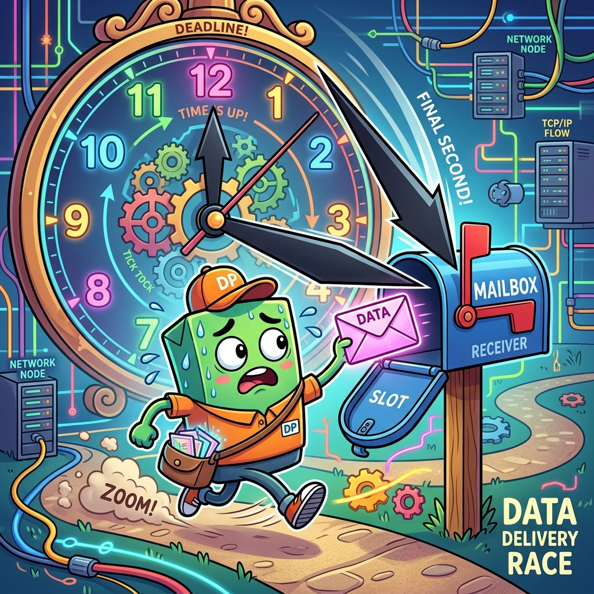
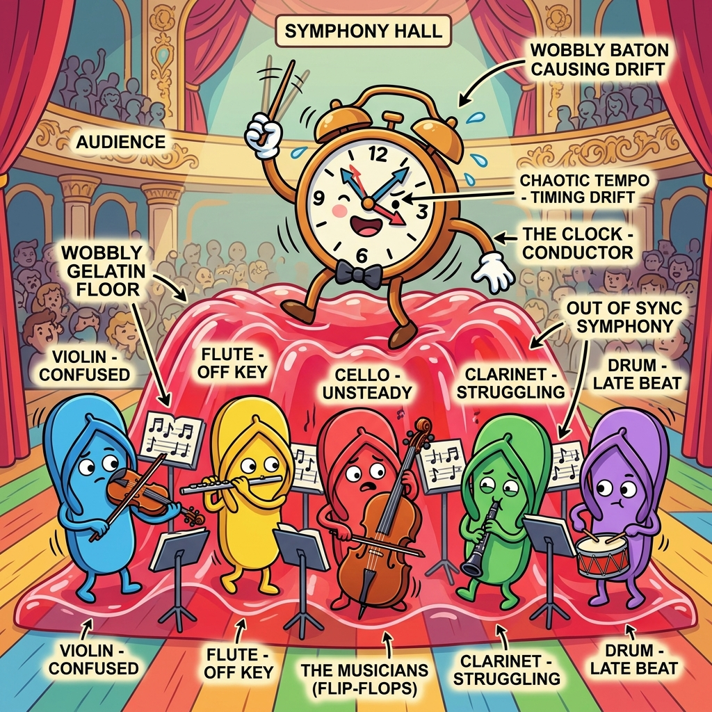

# Section 2.1: The Setup and Hold Ballet

If FPGA design is a theater production, timing closure is the choreography. You can have the most beautiful script (HDL) and the most expensive actors (HBM/SSI), but if your dancers (data signals) don't hit their marks at the exact same time as the music (the clock), the whole show falls apart. Welcome to the setup and hold ballet—the place where most FPGA dreams go to die.

Most beginners think timing is about "speed." They think, "My design runs at 200MHz, so I'm fast." But timing isn't about speed; it's about **certainty**. It’s about ensuring that every single flip-flop in your massive silicon city gets its data at exactly the right moment. If you're off by even a few picoseconds, your data becomes "metastable," and your design enters a state of digital madness.

### The Invisible Clock Edge

Think of a flip-flop as a camera. The clock edge is the shutter. When the shutter clicks, the camera captures whatever is in front of it. Setup time is the requirement that the subject (the data) must be standing still in front of the lens *before* the shutter clicks. Hold time is the requirement that the subject must stay still for a brief moment *after* the shutter clicks to make sure the image isn't blurred.

In a modern AMD FPGA, these times are measured in picoseconds. To a human, a picosecond is nothing. To a signal traveling at a significant fraction of the speed of light, a picosecond is enough time to travel across a few hundred logic cells. You aren't just writing code; you’re managing a high-speed physics experiment.

> **Brain Power**
> **If your clock period is 4ns (250MHz) and your data path takes 3.8ns to travel from Register A to Register B, you only have 200ps of setup margin. If the temperature of your chip rises and the silicon slows down by 5%, what happens to your timing?**

### Setup Time: The Race Against the Clock

Setup time is the "arrival" requirement. Your data has to race through lookup tables (LUTs), multiplexers, and routing tracks to get to the next register before the next clock edge arrives. If the path is too long, the data arrives late, and the flip-flop captures garbage. This is called a setup violation.

The UltraFast Methodology tells us that the best way to fix setup violations isn't to "optimize" the routing, but to **shorten the logic**. If you have six levels of LUTs between registers, you’re asking for trouble. Break that logic apart! Add more registers (pipelining) to give the data more time to "rest" between stages. In an FPGA, registers are free—use them like they're going out of style.



### Fireside Chat: Setup vs. Hold

**Setup:** "I'm exhausted. I had to go through three LUTs, a carry chain, and a long routing track. I barely made it before the clock edge! I need more time."

**Hold:** "Oh, shut up. At least you have a whole clock period to get where you're going. I have to arrive *instantly* and then stay perfectly still while the clock edge passes. If I move too fast, I'll accidentally trigger the *next* clock cycle's data. I'm the one who really suffers."

**Setup:** "Yeah, but if I'm late, the whole system crashes. If you're early, nobody even notices until the simulation fails."

**Hold:** "Exactly! I'm the silent killer. You can fix setup by slowing down the clock. You can't fix a hold violation by slowing down the clock. I'm a permanent physical error."

### Hold Time: The Minimum Delay Trap

Hold time is the "stability" requirement. It’s the rule that data must stay at the input of a flip-flop for a minimum amount of time after the clock edge. If the data changes too quickly—usually because the path between registers is too short—it will "leak" into the current clock cycle and cause a hold violation.

Hold violations are terrifying because they don't care about your clock frequency. If you have a hold violation at 100MHz, you’ll still have it at 10MHz. Vivado usually fixes these by adding "buffer" delays to the path, but if your clock skew is too high, the tools might run out of routing resources trying to slow down your data.

### The Skew Monster

Clock skew is the difference in arrival time of the same clock edge at two different flip-flops. Imagine two photographers trying to take a picture of the same runner at the exact same time, but one of them is standing 5 miles further away. Their shutters won't click simultaneously.

In a large FPGA, the clock signal has to travel through a massive distribution network (the clock tree). Even with AMD's highly optimized global clock buffers, there will be some skew. If the clock arrives at the destination register *after* it arrives at the source register, it helps your setup time but hurts your hold time. This is why using dedicated clocking resources (Section 1.3) is non-negotiable.

### Jitter and Uncertainty: The Wobbly Metronome

Jitter is the uncertainty in the clock period itself. No oscillator is perfect. Sometimes the clock cycle is 4.01ns, and sometimes it's 3.99ns. Vivado accounts for this using "Clock Uncertainty." It effectively "shrinks" your available timing budget to account for the worst-case wobble.

If you have a noisy power supply (remember Section 1.2?), your jitter will increase. This makes timing closure even harder. The UltraFast methodology emphasizes that a clean board design leads to a clean timing report. You can't fix bad hardware with good constraints.



### Code Detective: The Timing Summary

When you look at a Vivado timing report, you're looking for three magic numbers: WNS (Worst Negative Slack), TNS (Total Negative Slack), and WHS (Worst Hold Slack).

```tcl
# Code Detective: Is this a passing timing report?
# Check the Slack values
# WNS: -0.052ns
# TNS: -12.450ns
# WHS: 0.120ns
# WPWS: 1.200ns
# Hint: Slack must be POSITIVE to pass. 
```

The flaw here is that the user might see the positive WHS (Hold Slack) and think they are safe. But the **WNS is negative**, meaning the design is failing its setup requirements. Even a negative slack of -0.001ns is a failure. You cannot ship a design with negative slack. It might work on your desk at room temperature, but it will fail in the field when the sun comes out.

### Final Thoughts on the Ballet

Setup and hold times are the fundamental laws of digital logic. They are the reason we pipeline, the reason we floorplan, and the reason we care about PCB stackup. When you stop seeing your FPGA as a place for "code" and start seeing it as a high-speed temporal dance, you’ll find that timing closure becomes much more intuitive. Respect the clock, and the clock will respect you.

---
[REVIEW_STATUS: APPROVED BY PUBLISHER]