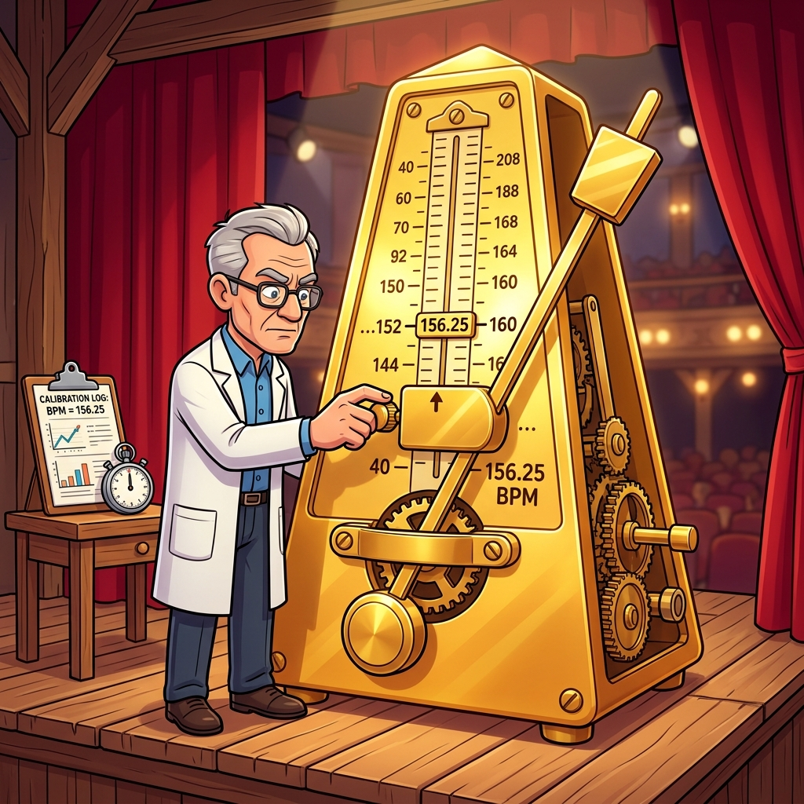

# Section 2.2: Constraints: Telling the Tools What to Do

If timing closure is a ballet, then XDC (Xilinx Design Constraints) is the script. Without it, the dancers have no idea when to move, and the orchestra is playing whatever they want. In the world of AMD FPGAs, the tools are incredibly smart, but they aren't psychic. If you don't tell them exactly what your timing requirements are, they will optimize for the wrong things, and your design will be a disorganized mess.

Constraints are the bridge between your high-level HDL and the physical reality of the chip. They tell Vivado, "This clock runs at 156.25MHz," and "This input arrives 2ns after the clock." Without these rules, Vivado will just try to make everything as fast as possible, which ironically leads to a design that is slower and harder to close.

### The XDC Language: Commands, Not Suggestions

XDC is based on the industry-standard SDC (Synopsys Design Constraints) format, but with some AMD-specific secret sauce. It’s a Tcl-based language, which means it’s powerful and flexible. But with great power comes the ability to completely shoot yourself in the foot.

The most important thing to remember is that constraints are **strict orders**. If you set a constraint that is physically impossible—like asking for 100Gbps through a single LUT—the tool will spend hours trying to achieve it, eventually failing and giving you a "routing congestion" error. You have to be realistic. The tools are your partners, not your slaves.

> **Brain Power**
> **If you have a 100MHz clock but you don't constrain it, Vivado will treat it as unconstrained. Will the timing report show a failure? Or will it just say "No paths found"? What are the risks of ignoring unconstrained paths?**

### Primary Clocks: Defining the Heartbeat

Everything starts with the primary clock. This is the clock that enters the FPGA from an external pin. It’s the "Master Beat" of your entire system. If you get this wrong, every other timing calculation in your design will be incorrect.

The `create_clock` command is your first line of defense. You need to specify the period and the port it’s attached to. AMD’s UltraFast methodology recommends defining your primary clocks as early as possible in the design cycle. If you change your clock frequency later, you’ll have to re-evaluate every single constraint in your file.



### Generated Clocks: The Derived Beats

Most modern designs don't just use one clock. They use PLLs (Phase-Locked Loops) or MMCMs (Mixed-Mode Clock Managers) to create new clocks from the primary one. These are "Generated Clocks." The magic of Vivado is that it can automatically derive these for you if you use the IP integrator, but sometimes you need to define them manually using `create_generated_clock`.

The danger here is "Clock Latency." A generated clock is always slightly delayed compared to its source. Vivado handles this automatically, but if you have a complex clock tree with multiple levels of division and multiplication, the uncertainty adds up. Keep your clock trees as shallow as possible to avoid the "latency tax."

### Fireside Chat: The Primary Clock and the PLL

**Primary Clock:** "I'm the boss. I come from a high-quality crystal oscillator outside the chip. I'm stable, I'm clean, and I set the pace for everything."

**PLL:** "Yeah, yeah, you're the boss, but I'm the one who does the work. I take your boring 100MHz and turn it into 400MHz for the memory controller and 25MHz for the LED blinker. I'm the flexible one here."

**Primary Clock:** "Flexible? You're a jitter factory! Every time you multiply me, you add uncertainty. If you aren't careful, you'll ruin the timing for the entire SLR."

**PLL:** "I'm just following orders! If the constraints say I need to be 400MHz, I'll be 400MHz. Just make sure the human tells me what to do, or I'll just sit here and vibrate."

### The False Path Escape Hatch

Sometimes, you have signals that cross between clock domains where timing doesn't matter. Maybe it’s a configuration register that only changes once a year. In these cases, you can use a `set_false_path` constraint. This tells Vivado, "Ignore this path. Don't waste any effort trying to make it fast."

**WARNING:** False paths are the most abused constraint in the world. Engineers use them to "hide" timing failures they don't know how to fix. If you set a false path on a signal that actually *does* need to be synchronized, you’ll get intermittent data corruption that is almost impossible to debug. The UltraFast methodology says: Use false paths only as a last resort, and always use a proper synchronization circuit (like a 2-stage flip-flop) first.


### Multi-Cycle Paths: Negotiating for Time

A multi-cycle path (`set_multicycle_path`) is a way to tell Vivado that a piece of logic has more than one clock period to complete its work. This is common in DSP operations or slow control loops. It’s like telling your boss, "I know the deadline is tomorrow, but I have a special permit to turn this in next week."

This is a great way to reduce power and congestion, but you have to be careful. If you tell the tools it's a multi-cycle path of 2, but your logic actually changes every cycle, you’ll get garbage data. You must ensure your RTL (the "Enable" signals) actually respects the multi-cycle constraint.

### Code Detective: The XDC Conflict

Vivado processes constraints in the order they appear in the file. If you have two constraints that affect the same path, the last one wins.

```tcl
# Code Detective: Which constraint is active for the 'clk_main' clock?
create_clock -period 10.000 -name clk_main [get_ports sys_clk]
create_clock -period 5.000 -name clk_fast [get_ports sys_clk]
# Hint: Look at the port names. Can one pin have two master clocks?
```

The flaw here is that the user is trying to define two different clocks on the **same physical port**. Vivado will overwrite the first one with the second one. If you have a port that can switch frequencies, you should use `create_clock` for the fastest frequency and use `set_case_analysis` or separate timing runs to handle the different modes. Defining two master clocks on one pin is a recipe for a "Critical Warning" and a very confused synthesis engine.

### Final Thoughts on Constraints

Constraints are the ultimate "Truth" in your design. They are how you communicate your intent to the silicon. A design with perfect RTL but bad constraints will never work. A design with mediocre RTL but perfect constraints has a fighting chance. Learn the language of XDC, respect the hierarchy, and never, ever use a false path to hide a real problem.

---
[REVIEW_STATUS: APPROVED BY PUBLISHER]
