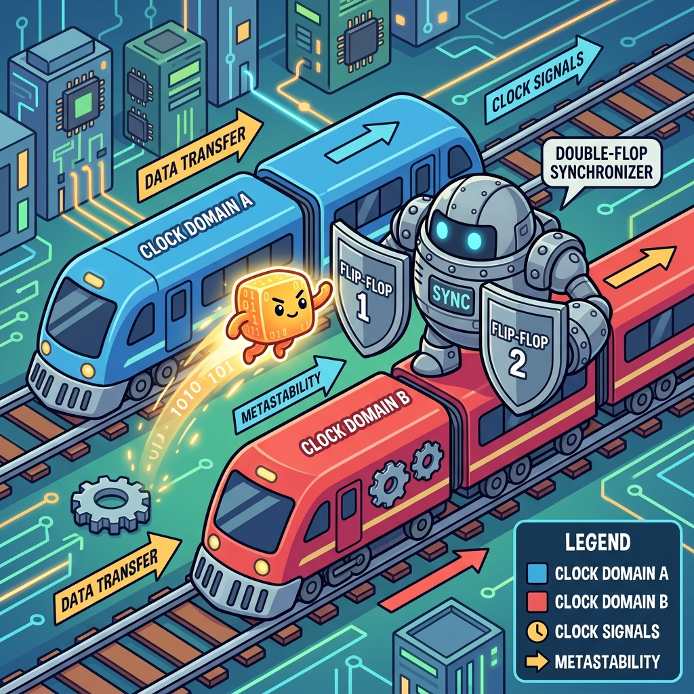
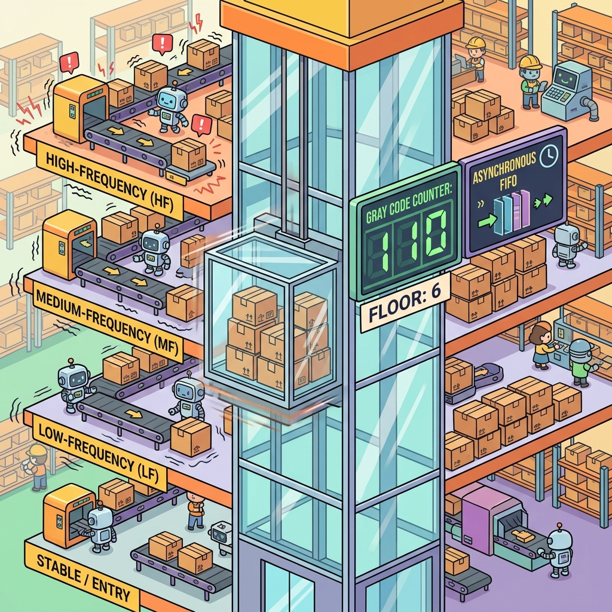

# Section 2.3: CDC: Crossing the Clock Domain Minefield

Welcome to the most dangerous part of FPGA design. If board layout is the foundation and timing closure is the ballet, then Clock Domain Crossing (CDC) is a minefield. One wrong step, and your design will work perfectly for three months, then suddenly crash in the middle of a critical operation—only to work perfectly again after a reboot. CDC errors are the "ghosts in the machine."

In a modern AMD FPGA, you might have fifty different clock domains. Data is constantly hopping from a 156MHz PCIe clock to a 322MHz transceiver clock, then over to a 100MHz system clock. Every time a signal crosses from one "time zone" to another without a proper passport, you risk a catastrophic phenomenon called **metastability**.

### Metastability: The Digital Twilight Zone

Remember the setup and hold times from Section 2.1? They only work when the data and the clock are synchronized. When data comes from a *different* clock domain, it can arrive at any time—including right in the middle of the setup/hold window.

When this happens, the flip-flop doesn't know whether to capture a '0' or a '1'. It enters a metastable state, where its output hovers somewhere in between, or oscillates wildly for a few picoseconds. Eventually, it will settle to a '0' or a '1', but by that time, the downstream logic has already seen the "glitch." Metastability is like a coin landing on its edge; it's unstable, unpredictable, and it will ruin your day.

> **Brain Power**
> **If you have a 100MHz clock and a signal that changes once per second, do you still need a synchronizer? Why or why not? What happens if that 1-second pulse happens to hit the setup window of your 100MHz clock?**

### The Synchronizer Guard: The Double-Flop Pass

The simplest way to fight metastability is the "Double-Flop Synchronizer." You pass the asynchronous signal through two flip-flops in a row, both clocked by the destination domain. The first flop might go metastable, but it has a whole clock period to "settle" before the second flop captures it.

This doesn't *eliminate* metastability (nothing can), but it reduces the probability of a failure to practically zero—measurable in billions of years (Mean Time Between Failures, or MTBF). In AMD UltraFast Methodology, any signal crossing a clock domain **must** have a synchronizer. No exceptions. No excuses.



### Fireside Chat: The Fast Clock and the Slow Signal

**Fast Clock (400MHz):** "I'm waiting! Where's that enable signal from the slow domain? I've ticked four hundred million times while you were just sitting there."

**Slow Signal (10MHz):** "Hey, I'm coming! I'm crossing the boundary now. Here I am!"

**Fast Clock:** "Woah, woah! You just arrived right as my shutter was closing. You're all blurry! My first flip-flop is vibrating like a tuning fork. I don't know if you're a 1 or a 0!"

**Slow Signal:** "Sorry, I don't have a watch that matches yours. Just use your second flip-flop. By the time it clicks, I'll be solid as a rock."

**Fast Clock:** "Good thing I have that second flop. If I had sent your 'blurry' version straight to the state machine, we'd be in a deadlock right now."

### The Bus Skew Disaster: The Silent Killer

A common—and deadly—mistake is trying to use a double-flop synchronizer on a multi-bit bus. Imagine you’re sending the value `0111` (7) to `1000` (8). If the individual bits arrive at slightly different times due to routing skew, the destination domain might capture `0000`, `1111`, or any other random value for one clock cycle.

You cannot synchronize a bus bit-by-bit. To move a bus across clock domains, you need a **Handshake** or an **Asynchronous FIFO**. A handshake involves a "request" signal, waiting for an "acknowledge" signal, and ensuring the data remains stable the whole time. It's safe, but it’s slow.

### Async FIFOs: The Silicon Elevators

When you need to move a lot of data quickly between domains, you use an Asynchronous FIFO (First-In-First-Out). It’s like a high-speed elevator between floors of a building. You write data on one side using the source clock, and you read it on the other side using the destination clock.

The magic happens in the "Gray Coded" pointers. Inside the FIFO, we have to compare the "Write Pointer" and the "Read Pointer" to know if the FIFO is full or empty. But these pointers live in different clock domains! To compare them safely, we convert them to Gray Code.



### Gray Coding: The One-Bit Trick

In standard binary, moving from `011` (3) to `100` (4) changes three bits at once. If you synchronize this, you have three opportunities for a CDC error. In Gray Code, only **one bit** changes at a time: `010` (3) to `110` (4).

Because only one bit changes, even if the destination clock captures the signal during a transition, it will either see the "old" value or the "new" value. It will *never* see a random, intermediate value. This is the secret sauce that makes high-speed FIFOs and counters safe in an asynchronous world.

### Code Detective: The CDC Constraint

Vivado needs to know when you are intentionally crossing clock domains so it can apply the right timing analysis (or ignore it).

```tcl
# Code Detective: Why is this 'set_max_delay' dangerous?
set_max_delay 2.0 -from [get_clocks clk_a] -to [get_clocks clk_b] -datapath_only
# Hint: Does this ensure that the bits of a bus arrive at the same time?
```

The flaw here is that `datapath_only` tells Vivado to ignore clock skew. While this is often used for CDC, it doesn't guarantee **bus skew**. If you use this on a 64-bit bus, the bits could still arrive in different clock cycles. You should also use the `set_bus_skew` constraint to ensure all bits of your crossing stay within a tight window, preventing the "Bus Skew Disaster" we discussed earlier.

### Final Thoughts on the Minefield

CDC is the ultimate test of an FPGA engineer's discipline. It’s easy to be lazy and skip a synchronizer "just this once." But in the world of high-reliability hardware, "just this once" is where the bugs live. Use double-flops for single bits, FIFOs for data, and always, always use Gray code for pointers. Respect the domain boundary, and your hardware will run for decades without a single "ghost" in sight.

---
[REVIEW_STATUS: APPROVED BY PUBLISHER]
