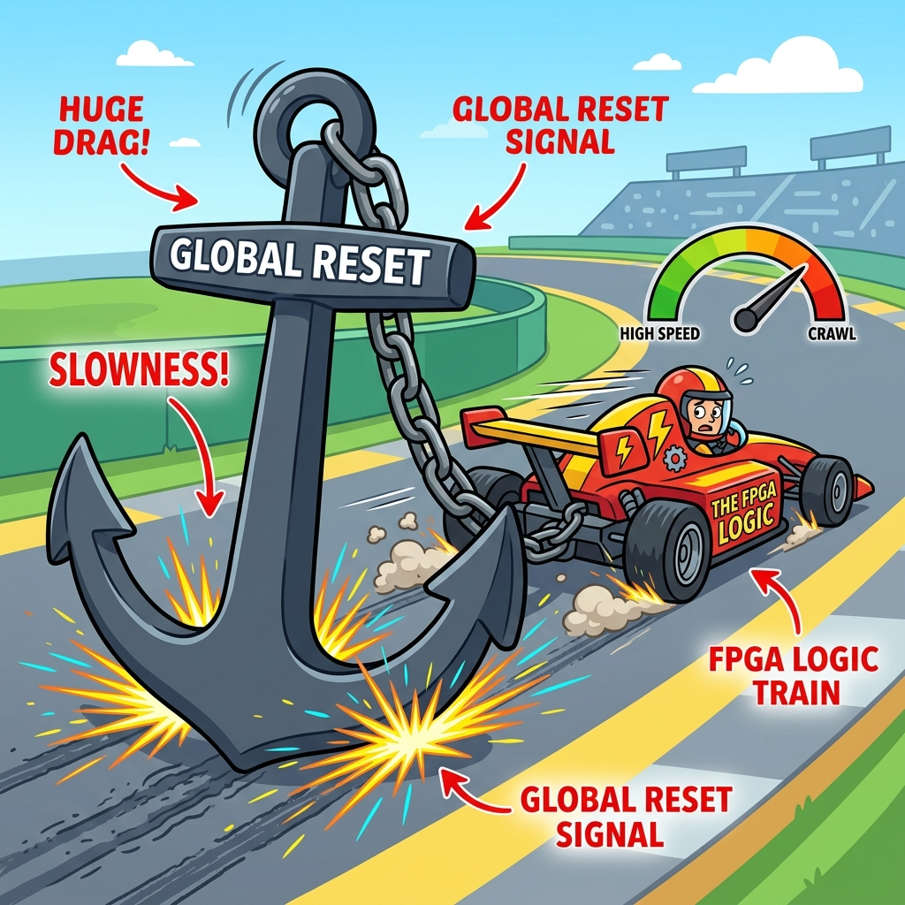

# Section 3.1: RTL Coding for Synthesis: Working with the Silicon, Not Against It

Many FPGA engineers think they are writing software. They treat Verilog or VHDL like C++ or Python. They write massive `always` blocks with nested `if-else` statements and hope the tools can figure it out. This is a recipe for a design that is slow, power-hungry, and impossible to route.

In the AMD UltraFast Methodology, we don't just "write code." We **describe hardware**. Every line of HDL you write is a direct instruction for how to arrange transistors, wires, and lookup tables. If you want to build a high-performance system, you have to write code that the synthesis engine can easily map to the physical resources of the FPGA.

### Inference vs. Instantiation: The Art of Letting Go

**Inference** is when you write generic HDL and let Vivado "infer" what hardware to use. For example, if you write `a + b`, Vivado will infer an adder. **Instantiation** is when you manually pull a specific component from the AMD library (like a `DSP48E2`) and wire it up yourself.

The rule of thumb is: **Always infer, unless you can't.** Inference makes your code portable and easier to read. Modern synthesis tools are incredibly good at recognizing patterns. However, if you need a very specific feature of a DSP block or a high-speed transceiver that the tools aren't picking up, then it’s time to instantiate.

> **Brain Power**
> **If you write a 32-bit multiplier in pure Verilog, will Vivado map it to a DSP slice or a massive pile of LUTs? What coding style (e.g., pipelining) is required to ensure it maps to the high-speed DSP hardware?**

### The Reset Trap: Less is More

One of the biggest performance killers in FPGA design is the **Global Reset**. Many engineers reset every single flip-flop in their design. This sounds safe, but it’s actually a disaster for routing. A global reset is a massive high-fanout signal that has to reach every corner of the chip at the exact same time.

In an AMD FPGA, many resources (like SRL16s and some DSP modes) don't even *have* a reset. If you force a reset on them, Vivado has to use extra LUTs and routing to emulate it, which slows down your design and uses more power. The UltraFast methodology recommends: **Reset only what is absolutely necessary** (like state machines and control registers). Let your data path be "uninitialized" at startup—the hardware will handle it.



### Fireside Chat: The Coder and the Synthesis Engine

**Coder:** "Look at this beautiful 64-bit nested if-else tree! It handles every possible edge case in one clock cycle. I'm a genius."

**Synthesis Engine:** "A genius? Do you have any idea how many levels of logic that creates? You’re asking for a path that is 50 LUTs deep. Our clock is 300MHz. I literally cannot build this."

**Coder:** "But it's just logic! Just find a faster way to route it."

**Synthesis Engine:** "I'm a tool, not a magician. If you want this to work, you need to pipeline it. Break that 64-bit tree into four stages of 16-bit logic. Give me some registers to work with, and I’ll give you a design that actually meets timing."

### Control Signal Overload: The Enable Bottleneck

Just like resets, **Clock Enables (CE)** can be a bottleneck. If every flip-flop has a unique enable signal, the routing engine becomes congested. Vivado tries to group flip-flops with the same control signals into a single "slice." If your code has a chaotic mix of resets and enables, the tools can't pack the slices efficiently.

Try to group your logic into "Control Sets." If twenty flip-flops share the same reset and the same enable, they can be packed tightly together. If they don't, they’ll be scattered across the die like autumn leaves, leading to longer wires and worse timing.

### DSP Mapping: Doing Math at the Speed of Light

AMD FPGAs have dedicated DSP slices that can do high-speed multiplication, addition, and even some logic operations. But to use them, your code has to follow a specific pattern. Specifically, DSP slices are designed to be **highly pipelined**.

If you write `result <= a * b + c`, but you don't put registers between the multiplier and the adder, Vivado might not be able to use the dedicated "Internal Feedback" paths of the DSP slice. To get the best performance, always add at least two or three stages of registers to any complex math operation. This allows the tools to "absorb" those registers into the DSP hardware itself.


### Code Detective: The Blocking vs. Non-Blocking Mix-up

Mixing blocking (`=`) and non-blocking (`<=`) assignments in the same `always` block is a classic "newbie" mistake that leads to simulation-synthesis mismatches.

```verilog
// Code Detective: Why is this counter dangerous?
always @(posedge clk) begin
    count = count + 1;
    if (count == 10) begin
        done <= 1'b1;
        count = 0;
    end
end
// Hint: What happens if 'done' is used elsewhere in the design?
```

The flaw here is the use of blocking assignments (`=`) inside a sequential block. This can create "race conditions" where the value of `count` depends on the order in which the simulator evaluates the lines. In synthesis, this might result in unintended combinational loops or incorrect register behavior. **Always use non-blocking (`<=`) for sequential logic** and blocking (`=`) only for combinational logic.

### BRAM and FIFO Inference: Memory that Fits

When you need to store data, you want to use Block RAM (BRAM) or UltraRAM (URAM). If you write a large array in your HDL, Vivado will try to infer a BRAM. But if you add a reset to that array, or if you try to read two different locations in the same clock cycle, Vivado will give up and use thousands of flip-flops instead.

Check the AMD HDL coding templates! They show the exact structure required for BRAM inference. Usually, it’s a simple array with a specific "read-before-write" or "write-before-read" behavior. Follow the template, keep the reset out of the memory array, and your design will be lean and mean.

### Final Thoughts on Synthesis

RTL coding for FPGAs is a physical act. You are carving logic out of silicon. The more you understand the underlying architecture—the slices, the DSPs, the BRAMs—the better your code will be. Don't fight the tools; give them the registers and the control sets they need to succeed. Write hardware, not software.

---
[REVIEW_STATUS: APPROVED BY PUBLISHER]
