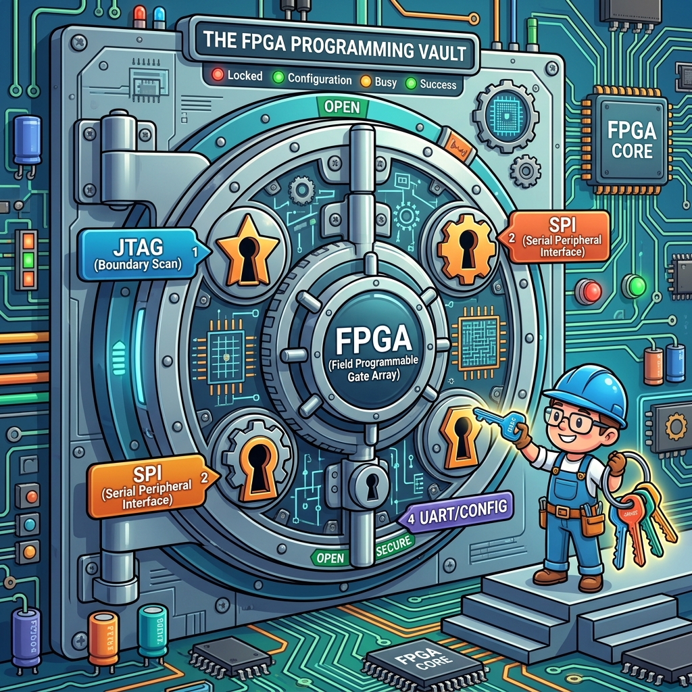
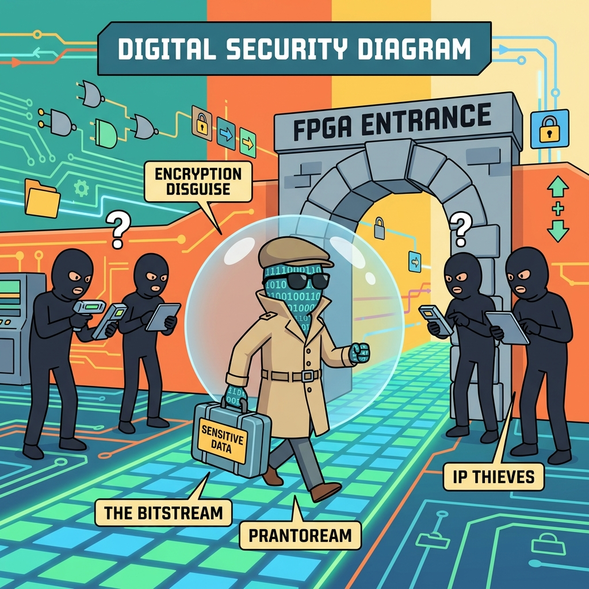

# Section 3.3: Configuration and Security: Locking the Vault

An FPGA is fundamentally a blank slate. When you turn off the power, it forgets everything it ever knew. Every time you turn it back on, it has to load its personality from an external memory source—a process we call **Configuration**. If you don't understand how your FPGA "wakes up," you’re building a brain without a nervous system.

But it’s not just about getting the bitstream into the chip. In today’s world, your design is your most valuable asset. If a competitor can just sniff the configuration wires and steal your bitstream, they’ve stolen your entire product. Configuration and Security are the two sides of the same coin: you need the FPGA to wake up reliably, and you need it to wake up securely.

### The Wake-Up Call: The Configuration Sequence

When power is applied to an AMD FPGA, it goes through a very specific ritual. First, it clears its internal memory (Housecleaning). Then, it samples its **Mode Pins** to see where it should look for its bitstream (The Search). Finally, it starts pulling in data, verifying it, and—if everything is correct—it asserts the `DONE` pin and starts running (The Activation).

If the `DONE` pin never goes high, your FPGA is essentially a very expensive space heater. Most configuration failures are caused by signal integrity issues on the flash memory interface or incorrect mode pin settings. The UltraFast Methodology emphasizes checking your configuration timing and signal quality as early as possible in the board bring-up phase.

> **Brain Power**
> **If your configuration flash memory is too slow, will the FPGA wait for it? Or will it time out and fail to boot? How do you coordinate the power-on-reset (POR) of the FPGA with the readiness of the flash chip?**

### Choosing Your Interface: SPI, BPI, or JTAG?

There are several ways to get a bitstream into an FPGA. **JTAG** is the slow, reliable interface used for debugging. **SPI (Serial Peripheral Interface)** is the most common for production, as it uses small, cheap flash chips. **BPI (Byte Peripheral Interface)** is faster but uses more pins.

The choice depends on your requirements. If you need your FPGA to be ready to process data within 100 milliseconds of power-on (like a PCIe device), you might need a high-speed BPI interface or a quad-SPI setup. If speed doesn't matter, a standard SPI chip is usually the way to go. Pick the right "keyhole" for your design's needs.



### Fireside Chat: The JTAG Cable and the SPI Flash

**JTAG Cable:** "I'm the doctor. I can see inside your brain, I can step through your logic, and I can load a bitstream even if your board is half-broken. I'm the ultimate debugger."

**SPI Flash:** "That’s nice, but you're a cable. When the product is in the customer's hands, you're back in the lab. I'm the one who lives on the board. I'm the one who wakes the FPGA up every single morning."

**JTAG Cable:** "Yeah, but you're slow. It takes you forever to load a 100MB bitstream. I can do a 'boundary scan' and tell the engineer exactly which pin is shorted to ground."

**SPI Flash:** "Speed doesn't matter if you aren't there. I'm the permanent memory. Just make sure the engineer doesn't mess up my clock frequency, or I'll stay silent and the whole system will be a brick."

### The Safety Net: Multi-Boot and the Golden Image

Imagine you’re performing a remote firmware update on a system in a satellite or a deep-sea sensor. If the power fails during the update, the bitstream in the flash becomes corrupted. Your FPGA will never boot again. You’ve just created a multi-million dollar piece of e-waste.

To prevent this, we use **Multi-Boot**. We store a "Golden Image" (a known-good, minimal version of the design) at the beginning of the flash memory. We store the "Update Image" further down. If the update image fails its checksum, the FPGA automatically falls back to the Golden Image. It’s a safety net that saves you from a world of hurt.

### Bitstream Encryption: Protecting the Crown Jewels

If someone gets a copy of your bitstream, they can reverse-engineer your logic or, worse, clone your entire product. AMD FPGAs support **AES-256 encryption**. You can load a secret key into the FPGA’s internal battery-backed RAM (BBRAM) or eFUSEs.

Once encrypted, the bitstream is just a pile of random numbers to anyone who doesn't have the key. The FPGA decrypts the bitstream internally as it loads. This is the gold standard for IP protection. If you’re building anything remotely proprietary, you **must** encrypt your bitstream.



### Authentication and Secure Boot: Trust but Verify

Encryption prevents people from *reading* your code. **Authentication** prevents people from *replacing* your code. By using digital signatures (RSA or ECDSA), the FPGA can verify that the bitstream it’s loading was actually created by you and hasn't been tampered with.

This is the core of "Secure Boot." It ensures that no "malicious" bitstream can ever run on your hardware. In a world where hardware-level hacking is becoming more common, authentication is just as important as encryption. Trust your bitstream, but verify it every time you boot.

### Code Detective: The Multi-Boot Tcl Script

You can use Tcl commands in Vivado to set the jump addresses for your Multi-Boot fallback.

```tcl
# Code Detective: Why will this fallback fail?
set_property BITSTREAM.CONFIG.CONFIGFALLBACK ENABLE [current_design]
set_property BITSTREAM.CONFIG.NEXT_CONFIG_REBOOT_ADDR 0x01000000 [current_design]
# Hint: What happens if the Golden Image itself is corrupted?
```

The flaw here is that the user has enabled fallback, but they haven't specified the **Golden Image address**. By default, the FPGA looks at address `0x00000000` for the initial boot. If that boot fails, it needs a specific instruction on where to go next. If you don't have a known-good image at the very beginning of the flash (or a clear path to one), the fallback mechanism has nowhere to fall back *to*. Always ensure your Golden Image is protected and sitting at the primary boot address.

### Final Thoughts on the Vault

Configuration is the bridge between the physical board and the digital logic. Security is the wall that protects that logic from the outside world. By mastering Multi-Boot, encryption, and authentication, you ensure that your design is not only performant but also resilient and secure. Lock the vault, keep the keys safe, and let your FPGA wake up with confidence.

---
[REVIEW_STATUS: APPROVED BY PUBLISHER]
