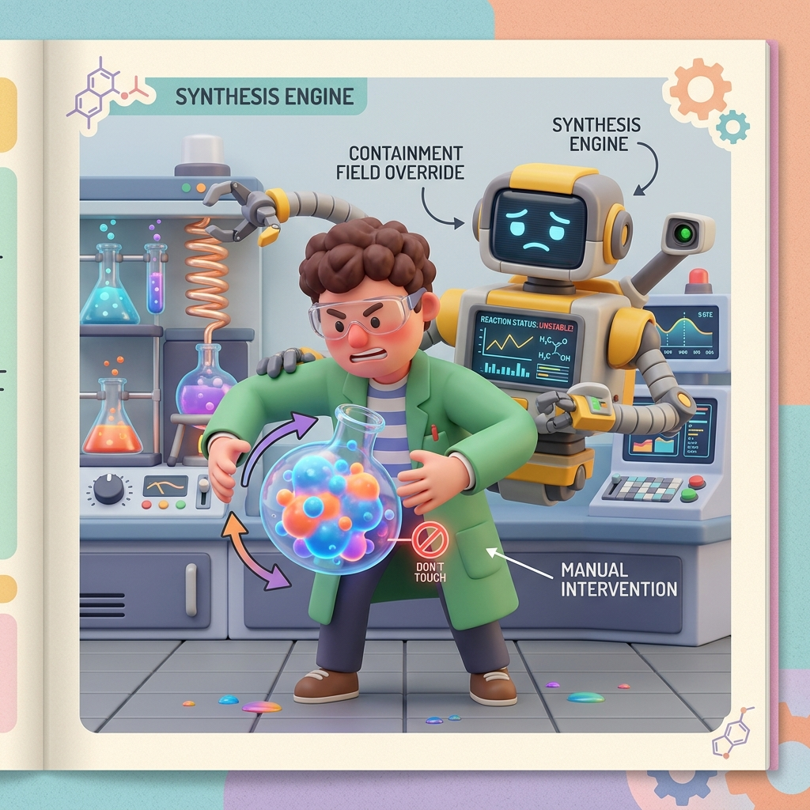

# Section 4.1: Synthesis Strategies: The Alchemist's Forge

Synthesis is the moment of truth. It’s where your beautiful, abstract HDL code is melted down and forged into a physical netlist of gates, lookup tables (LUTs), and flip-flops. In the AMD UltraFast Methodology, synthesis is not just a push-button process; it’s an alchemical art. If you give the synthesis engine the right "ingredients" (attributes and settings), you’ll get a design that is fast and efficient. Give it the wrong ones, and you’ll end up with a mess of "logic sludge" that will never meet timing.

### The Alchemist's forge: Transforming Logic

The goal of synthesis is to find the best physical implementation for your logic. Vivado has several "Strategies" you can choose from. Most people start with the **Default** strategy, which is a good balance of speed and area. But if you’re pushing the limits of your FPGA, you might need to use **Flow_PerfOptimized_high** or **Flow_AreaOptimized_high**.

Think of these strategies like different recipes. One might focus on making the logic as fast as possible by adding extra registers (Pipelining), while another might focus on making it as small as possible by sharing resources. Choosing the right strategy early on can save you hours of implementation time later.

> **Brain Power**
> **If you use a "Performance Optimized" strategy, will your design use more or fewer LUTs than the "Area Optimized" version? Why might a "Performance Optimized" design actually be *easier* to route?**

### The DONT_TOUCH Trap: Letting the Tools Work

A common mistake for experienced designers is using the `DONT_TOUCH` attribute on everything. They think they know better than the tool, so they "lock" their signals to prevent the synthesis engine from optimizing them. In the AMD UltraFast world, this is a dangerous game.

`DONT_TOUCH` prevents the tool from performing "Logic Optimization." If the tool sees two identical pieces of logic, it can't merge them. If it sees a signal that is constant, it can't remove it. This creates "Optimization Debt" that clogs up the routing engine. **Use `DONT_TOUCH` sparingly**, and only when you have a very specific reason to keep a signal alive (like for an ILA probe).



### Fireside Chat: The RTL Coder and the Synthesis Expert

**RTL Coder:** "My synthesis report says I'm using 80% of the LUTs on the chip! I haven't even added the PCIe core yet. What happened?"

**Synthesis Expert:** "Let me see your resets. Ah, here it is. You’re resetting every single counter and register in your data path. Because of those resets, the synthesis engine can't use the dedicated SRL16 resources. It’s building everything out of LUTs and flip-flops."

**RTL Coder:** "But I need those resets! What if the system glitches?"

**Synthesis Expert:** "You only need to reset the *control* logic. Let the data path be uninitialized. If you remove those unnecessary resets, the synthesis engine can pack your logic into Shift Register LUTs (SRLs). You’ll drop from 80% utilization to 20% in five minutes. Stop being a 'reset-happy' coder and start being a hardware architect."

### Control Set Optimization: Packing the Slices

AMD FPGAs organize flip-flops into groups called **Slices**. To fit into a slice, flip-flops must share the same **Control Set** (Clock, Reset, and Clock Enable). If your code has a chaotic mix of different resets and enables, the synthesis engine has to scatter your flip-flops across multiple slices, which wastes space and creates long wires.

The UltraFast methodology recommends **Control Set Reduction**. By minimizing the number of unique resets and enables, you allow the tools to pack your logic tightly. Think of it like packing a suitcase. If everything is the same shape, it’s easy. If everything is a different shape, you’re going to have a lot of wasted space.

### Timing-Driven Synthesis: The Critical Path

Vivado is a **Timing-Driven** tool. It looks at your XDC constraints (which we discussed in Chapter 2) and prioritizes the logic paths that are closest to failing their timing requirements. If a path has plenty of "slack," the tool will optimize it for area. If a path is "tight," the tool will pull out all the stops to make it fast.

This is why accurate constraints are so important. If you tell the tool that a 100MHz clock is actually 500MHz, the synthesis engine will waste all its energy trying to make that logic super-fast, potentially ruining the timing for the *rest* of your design. Be honest with the tools, and they will be honest with you.


### Code Detective: The Flattening Mystery

By default, Vivado maintains your design's hierarchy. But you can tell it to "Flatten" the design using the `-flatten_hierarchy` setting.

```tcl
# Code Detective: Why might 'rebuilt' flattening be better than 'full'?
synth_design -top top_module -part xcku040-ffva1156-2-e -flatten_hierarchy full
# Hint: What happens to your signal names when you use 'full' flattening?
```

The flaw with `full` flattening is that it destroys your hierarchy and renames your signals to random strings of characters. This makes it **impossible to debug** using an ILA. The `rebuilt` setting is often a better choice—it allows the synthesis engine to optimize across hierarchical boundaries but "rebuilds" the hierarchy at the end so you can still find your signals. Don't lose your signal names just to save a few LUTs.

### Final Thoughts on the Forge

Synthesis is the bridge between the digital dream and the physical reality. By choosing the right strategies, minimizing `DONT_TOUCH` attributes, and optimizing your control sets, you give the synthesis engine the freedom it needs to build a world-class design. Respect the forge, and it will give you a design that is strong, lean, and fast.

---
[REVIEW_STATUS: APPROVED BY PUBLISHER]
