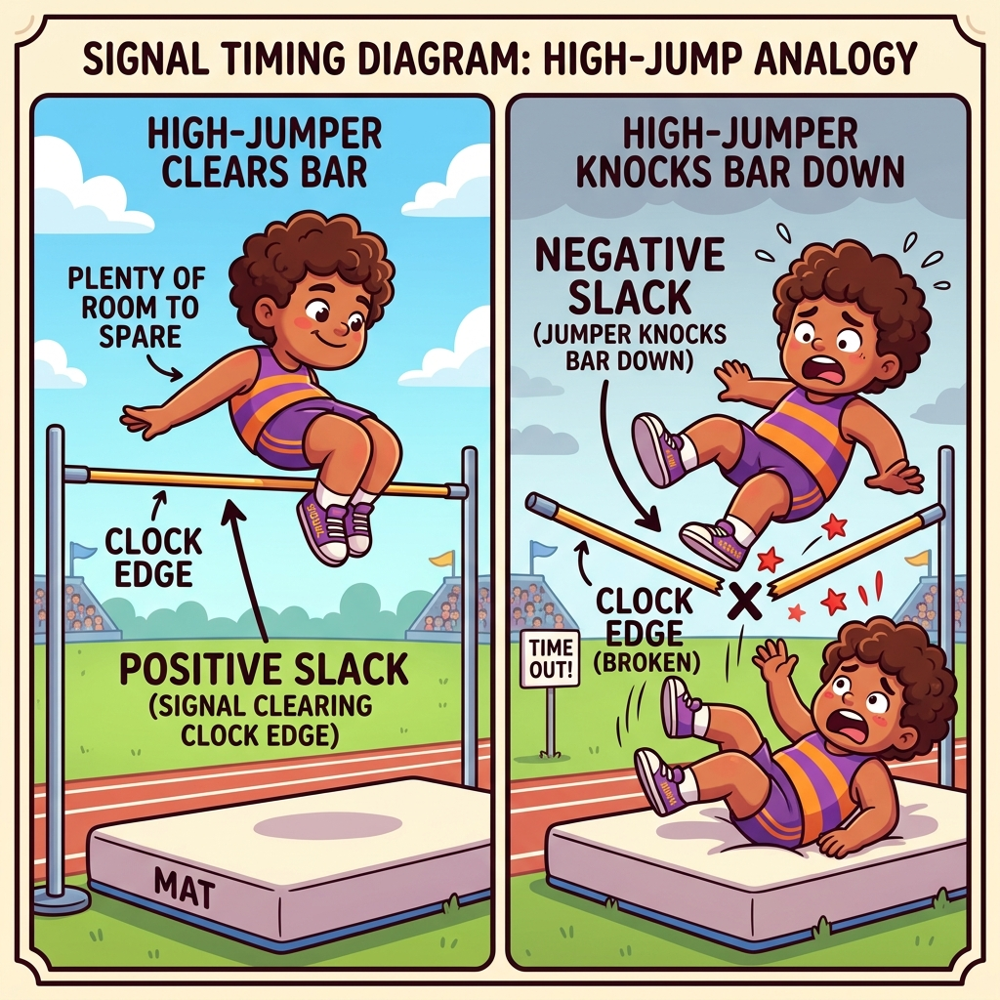

# Section 4.3: Design Closure and Iteration: The Final Polish

You’ve synthesized your design, placed it on the grid, and routed the wires. Now comes the most intense part of the FPGA lifecycle: **Timing Closure**. This is the process of ensuring that every single signal in your design reaches its destination before the next clock edge. If even one signal is a few picoseconds late, your design is officially "broken."

In the AMD UltraFast Methodology, design closure is not a one-time event; it’s an iterative loop. You run the tools, analyze the results, tweak your code or constraints, and run them again. It’s the final polish that turns a "good" design into a "production-ready" one.

### The Final Polish: Reaching the Finish Line

When you run the implementation tools, Vivado generates a **Timing Report**. This report is your roadmap for closure. It tells you the "Worst Negative Slack" (WNS)—the amount of time by which your slowest path failed. If WNS is positive, you’ve met timing. If it’s negative, you have work to do.

Think of timing closure like a professional athlete trying to shave a fraction of a second off their personal best. You aren't looking for massive changes anymore; you’re looking for tiny optimizations—a LUT here, a register there—that will give you the slack you need to cross the finish line.

> **Brain Power**
> **If your design fails timing by 50 picoseconds, should you go back and rewrite the entire RTL? Or should you try different implementation strategies first? What is the "Rule of Diminishing Returns" in timing closure?**

### Slack Analysis: The Margin of Safety

**Slack** is the difference between the "Required Time" (when the signal must arrive) and the "Arrival Time" (when the signal actually arrives). Positive slack is your margin of safety. Negative slack is a timing violation.

Analyzing slack is about finding the "Low-Hanging Fruit." Sometimes a path fails because of a single long wire. Other times, it fails because of a massive chain of logic. By identifying the *reason* for the negative slack, you can choose the right tool to fix it. If the delay is mostly logic, pipeline it. If the delay is mostly routing, try a different placement strategy.



### Fireside Chat: The Perfectionist and the Practical Engineer

**Perfectionist:** "I’ve been iterating on this 10G Ethernet core for three days. I’ve reached 10 picoseconds of positive slack, but I want to get it to 100. I’m going to try one more implementation strategy."

**Practical Engineer:** "Why? 10 picoseconds of positive slack is a pass. The bitstream will work. The hardware doesn't care if you passed by a mile or an inch. We need to ship this product by Friday."

**Perfectionist:** "But what if the temperature changes? What if the voltage drops? 10 picoseconds feels too risky!"

**Practical Engineer:** "Vivado’s timing analysis already accounts for 'Worst Case' temperature and voltage. If the tool says you passed, you passed. Stop chasing ghosts and start working on the user manual. Done is better than perfect."

### The Timing Report Deep Dive: The Autopsy

When a path fails timing, you need to perform an "Autopsy." The Timing Summary report shows you the exact breakdown of the delay. It tells you how much time was spent in the LUTs, how much in the flip-flops, and how much in the copper wires.

Look for the **Logic Levels**. If a path has 15 levels of logic between registers, it will never meet timing at 400MHz. You need to "break" that path by adding registers (Pipelining). If the report shows a single "Route Delay" that is 80% of the total path, you have a placement problem. Implementation can move logic and reroute nets; it cannot restructure your RTL. Use the autopsy to find the root cause.

### Critical Path Optimization: Shaving Picoseconds

Once you’ve found your critical paths, you have several techniques for optimizing them:

1.  **Retiming:** Moving registers across logic boundaries to balance the delay.
2.  **Logic Replication:** Creating multiple copies of a high-fanout signal to reduce the load on a single driver.
3.  **Physical Constraints:** Using `USER_PBLOCKS` or `LOC` constraints to force the tools to place critical components closer together.

These are "surgical" interventions. You don't want to use them on the whole design—just on the few paths that are causing you pain.


### Code Detective: The False Path Fallacy

Sometimes, a path "fails" timing, but the failure doesn't actually matter. These are called **False Paths**.

```tcl
# Code Detective: Why is this 'set_false_path' dangerous?
set_false_path -from [get_pins reset_reg/C] -to [all_registers]
# Hint: Is there any scenario where the timing of the reset signal actually MATTERS?
```

The flaw here is a "Global False Path" on the reset signal. While the *activation* of a reset is often asynchronous, the *release* of a reset must be synchronous to the clock. If some registers come out of reset one cycle before others, your state machine could end up in an illegal state.

Name the checks being deleted, because that is what makes it concrete. Timing analysis of
a reset consists of **recovery** (the reset must deassert far enough *before* the clock
edge, the analogue of setup) and **removal** (it must stay deasserted far enough *after*,
the analogue of hold). A false path on the reset deletes both. The design then meets
timing while containing a reset network that can release different flops on different
cycles — and a one-hot state machine that comes out of reset with two bits set is a
machine that never reaches a legal state again until the next power cycle.

**The fix** is to make the release synchronous so the checks *pass* rather than
disappearing:

```systemverilog
// Asynchronous assert, synchronous release - one macro, per destination domain.
xpm_cdc_sync_rst #(
    .DEST_SYNC_FF (4),
    .INIT         (1),      // reset asserted at power-up
    .INIT_SYNC_FF (1)
) u_rst_sync (
    .src_rst  (async_rst_in),   // asserts immediately, no clock required
    .dest_clk (clk),
    .dest_rst (rst)             // deasserts synchronously to clk
);
```

```tcl
# Now the reset is a normal synchronous signal in each domain, and recovery/removal
# analysis is meaningful. The only exception you need is on the ASYNCHRONOUS INPUT
# to the synchronizer - narrowly scoped, not global:
set_false_path -from [get_ports async_rst_in] -to [get_cells u_rst_sync/*]

# Verify, rather than assume:
report_timing -to [get_cells -hier -filter {NAME =~ "*rst*" && IS_SEQUENTIAL}] \
              -delay_type min_max -max_paths 20
check_timing -verbose        ;# look for missing recovery/removal analysis
report_cdc -details          ;# reset crossings show up here too
```

The distinction to carry away: **narrow, justified exceptions on genuinely asynchronous
signals are correct engineering; broad exceptions that make reports look good are
self-deception.** A `set_false_path -to [all_registers]` is always the second kind.

### Analogy → Silicon

| In the story | In the silicon | Where the analogy breaks |
| --- | --- | --- |
| Shaving a fraction off a personal best | Recovering the last tens of picoseconds with `phys_opt_design` and directive sweeps | An athlete improves monotonically; implementation results are *noisy*, and the same design can move ±50 ps between runs on identical inputs |
| The autopsy | Decomposing a failing path into $T_{co}$, logic delay, net delay and `Logic Levels` | An autopsy has one cause of death; a failing path usually has a dominant term and several contributing ones, and the split tells you which |
| Surgery on a critical path | `MAX_FANOUT`, logic replication, `LOC`/pblock constraints, retiming | Surgery is local by nature; a `LOC` constraint on a busy region displaces other logic and can create a new critical path elsewhere |
| "Done is better than perfect" | Sign-off at a positive WNS against a *complete* constraint set | The sentiment is right and the emphasis is wrong: the risk is not insufficient margin, it is an incomplete constraint set that made the margin meaningless |
| Diminishing returns | The point where a directive sweep costs more machine-hours than the picoseconds are worth | Returns diminish smoothly in the analogy; here there is a **step change** — an architectural fix restarts the curve, a heuristic does not |

### Do the Math

#### Decomposing a failing path into an action

The whole skill of closure is turning one report into one decision. The decomposition:

$$T_{\text{path}} = T_{co} + T_{\text{logic}} + T_{\text{net}}$$

**Givens** — three failing paths from a real timing summary, all on a 2.500 ns clock:

| Path | `Data Path Delay` | logic | route | `Logic Levels` | Slack |
| --- | --- | --- | --- | --- | --- |
| A | 2.910 ns | 2.331 ns (80 %) | 0.579 ns (20 %) | 12 | −0.431 ns |
| B | 2.870 ns | 0.574 ns (20 %) | 2.296 ns (80 %) | 3 | −0.391 ns |
| C | 2.760 ns | 1.380 ns (50 %) | 1.380 ns (50 %) | 6 | −0.281 ns |

**Path A** — logic-dominated, 12 levels. Target the depth. If you split it into two
balanced stages:

$$T_{\text{logic,new}} \approx \frac{2.331}{2} = 1.166\ \text{ns} \quad \Longrightarrow \quad T_{\text{path}} \approx 0.089 + 1.166 + 0.579 = 1.834\ \text{ns}$$

$$\text{Slack} \approx 2.479 - 1.834 = +0.645\ \text{ns} \quad \checkmark$$

Cost: one cycle of latency. Verdict: **pipeline it.**

**Path B** — route-dominated, only 3 levels. Pipelining would split 574 ps of logic and
leave 2.296 ns of routing untouched:

$$T_{\text{path,new}} \approx 0.089 + 0.287 + 2.296 = 2.672\ \text{ns} \quad \Longrightarrow \quad \text{Slack} \approx -0.193\ \text{ns}$$

**Still failing**, and you have paid a cycle of latency for it. Verdict: **do not
pipeline.** Attack the route — check fanout, replicate the driver, pull the endpoints
together. If a single net is most of that 2.296 ns, `MAX_FANOUT` alone may fix it.

**Path C** — balanced. This is the one where a directive sweep and `phys_opt_design` are
genuinely the right tools, because there is no single dominant term to attack.

**The rule extracted:** compute the *post-fix* delay before doing the fix. Two minutes of
arithmetic routinely saves a day of implementation runs.

#### When to stop

$$\text{Value of continuing} = \Delta\text{WNS expected} \times \text{probability of success} - \text{engineering cost}$$

**Givens** — typical numbers, worth calibrating against your own history:

| Action | Expected ΔWNS | Machine cost | Engineering cost |
| --- | --- | --- | --- |
| One more directive | +10 to +50 ps | 3 h | ~0 |
| Full directive sweep (20 runs) | +50 to +150 ps | 68 h | ~0.5 day |
| Fanout / replication fix | +100 to +400 ps | 3 h | 0.5 day |
| Pipeline a critical path | +300 to +800 ps | 3 h | 1–3 days (incl. re-verification) |
| Floorplan a congested region | +100 to +500 ps | 6 h | 1–2 days |

If you are at −0.050 ns, a directive sweep is the correct answer and pipelining is
absurd. If you are at −0.600 ns, sweeping is a way to spend three days proving you needed
to pipeline. **Match the tool to the size of the deficit** — that single habit is most of
what separates a two-day closure from a three-week one.

### The Real Artifact

An implementation script built around the closure loop, with the incremental flow that
makes iteration cheap.

```tcl
#==============================================================================
# impl.tcl - implementation with a closure loop that converges.
#
# Two features that pay for themselves immediately:
#   * QoR suggestions are written after one run and READ BACK on the next, so the
#     tool acts on its own advice instead of just printing it.
#   * Incremental implementation reuses the previous placement/routing, cutting
#     runtime dramatically for small changes - which is what makes an iterative
#     loop practical rather than a once-a-day ritual.
#==============================================================================

set build ./build
set ref   $build/routed_reference.dcp

open_checkpoint $build/post_synth.dcp

#------------------------------------------------------------------------------
# 1. Reuse the previous run's placement when the change was small.
#    'more_than_pin_swaps' means: reuse aggressively, but re-place anything the
#    netlist change actually affected.
#------------------------------------------------------------------------------
if {[file exists $ref]} {
    read_checkpoint -incremental $ref
    puts "INFO: incremental flow enabled against $ref"
}

# Feed back what the tool told us last time.
if {[file exists $build/qor.rqs]} {
    read_qor_suggestions $build/qor.rqs
}

#------------------------------------------------------------------------------
# 2. The flow. Directives start at Default and change only in response to a
#    diagnosis - see "Do the Math".
#------------------------------------------------------------------------------
opt_design      -directive Default
place_design    -directive Default
phys_opt_design -directive Default
route_design    -directive Default

# The second phys_opt pass, post-route, is frequently worth 30-80 ps and costs
# minutes. Skipping it is leaving free margin on the table.
phys_opt_design -directive AggressiveExplore

write_checkpoint -force $build/post_route.dcp

#------------------------------------------------------------------------------
# 3. Sign-off reports. All of them, every time - a build whose reports you did
#    not generate is a build you cannot reason about later.
#------------------------------------------------------------------------------
report_timing_summary -delay_type min_max -report_unconstrained \
    -check_timing_verbose -max_paths 10 -file $build/timing_summary.rpt

report_design_analysis -logic_level_distribution \
    -of_timing_paths [get_timing_paths -max_paths 1000 -slack_lesser_than 0] \
    -file $build/logic_levels.rpt

report_qor_suggestions -file $build/qor_suggestions.rpt
write_qor_suggestions -force $build/qor.rqs

report_methodology -file $build/methodology.rpt
report_cdc -details   -file $build/cdc.rpt
report_utilization    -file $build/utilization.rpt

#------------------------------------------------------------------------------
# 4. The gate. Sign-off is not "WNS is positive" - it is "WNS is positive AND
#    the constraint set is complete AND the methodology checks pass."
#    A positive WNS on an incomplete constraint set is a wrong answer, not a
#    lenient one.
#------------------------------------------------------------------------------
proc signoff_gate {} {
    set wns [get_property SLACK [get_timing_paths -delay_type max -max_paths 1]]
    set whs [get_property SLACK [get_timing_paths -delay_type min -max_paths 1]]

    set fail 0
    if {$wns < 0} { puts "FAIL: WNS = $wns ns";  set fail 1 }
    if {$whs < 0} { puts "FAIL: WHS = $whs ns";  set fail 1 }

    # Unconstrained endpoints mean the tool was never asked about part of your
    # design, and that matters MORE than the WNS number above it. There is no
    # clean Tcl accessor, so read it back out of the summary we just wrote.
    set fh [open $::build/timing_summary.rpt r]
    set summary [read $fh]
    close $fh
    if {[regexp {There are (\d+) register/latch pins with no clock} $summary -> n]} {
        puts "FAIL: $n register/latch pin(s) with no clock - see check_timing section"
        set fail 1
    }

    # Methodology violations that are timing-related are not style advice.
    set meth [get_methodology_violations -quiet -severity {CRITICAL WARNING}]
    if {[llength $meth] > 0} {
        puts "FAIL: [llength $meth] methodology violation(s) - see methodology.rpt"
        set fail 1
    }

    # CDC criticals are functional bugs, and they do not appear in WNS at all.
    set cdc [get_cdc_violations -quiet -severity Critical]
    if {[llength $cdc] > 0} {
        puts "FAIL: [llength $cdc] critical CDC violation(s) - see cdc.rpt"
        set fail 1
    }

    if {$fail} {
        error "Sign-off gate failed."
    }
    puts "SIGN-OFF PASSED: WNS $wns ns, WHS $whs ns, no methodology or CDC criticals."
}

signoff_gate

# Keep this run as the reference for the next incremental iteration.
file copy -force $build/post_route.dcp $ref
```

### Sharpen Your Pencil

1. A path has `Data Path Delay: 3.400ns (logic 0.680ns (20%) route 2.720ns (80%))`,
   `Logic Levels: 2`, on a 3.000 ns clock. Compute the slack improvement you would expect
   from pipelining it, and say what you would do instead.
2. Your design is at WNS −0.045 ns with TNS −0.045 ns. Using the cost table above, pick
   your next action and justify it in one sentence.
3. `report_timing_summary` shows WNS +0.312 ns, and `check_timing` reports 47
   `unconstrained_internal_endpoints`. Is this design ready to ship? Explain what the
   +0.312 ns actually means.

### Final Thoughts on Closure

Timing closure is where the science of FPGA design meets the grit of engineering. It’s about persistence, analysis, and knowing when to stop. By mastering the timing report and learning to perform autopsies on your critical paths, you ensure that your design is robust, reliable, and ready for the real world. Polish the design, close the timing, and claim your victory.

### Answers

**Brain Power** — *Failing by 50 ps: rewrite the RTL, or try implementation strategies
first? What is the rule of diminishing returns here?*

**Try implementation strategies.** At 50 ps you are inside the range where heuristics
operate. From the cost table: one more directive is expected to be worth 10–50 ps at
essentially zero engineering cost, and a `phys_opt_design -directive AggressiveExplore`
post-route pass alone frequently finds 30–80 ps. Rewriting RTL for 50 ps means days of
work plus re-verification, to buy something a three-hour machine run probably delivers.

The rule of diminishing returns, stated usefully: **each successive fix has a smaller
expected gain and a larger cost, so match the tool to the size of the deficit.**

| Deficit | Right tool |
| --- | --- |
| < 50 ps | `phys_opt_design`, one directive change |
| 50–150 ps | Directive sweep, fanout reduction |
| 150–400 ps | Replication, targeted floorplanning |
| > 400 ps | Architecture: pipelining, restructuring, a different device |

The critical nuance the analogy misses: **the curve is not smooth.** An architectural fix
does not give you a slightly better result than a directive — it *restarts the curve* at a
new baseline. So "diminishing returns" applies within a class of fix, not across classes.
Someone who sweeps directives for a week on a −0.600 ns design is not experiencing
diminishing returns; they are using the wrong tool, indefinitely.

One more thing worth saying about the 50 ps case, since the Fireside Chat above touches
it: the reason 10 ps of positive slack is genuinely acceptable is **not** that "the tool
accounts for the corners so you passed." It is that sign-off is against your constraint
set, at characterised corners, with clock uncertainty already subtracted. The question
worth worrying about is therefore never "is 10 ps enough margin?" but "**is my constraint
set complete?**" — which is what *Sharpen Your Pencil #3* is about.

**Sharpen Your Pencil #1** — 3.400 ns path, route 80 %, `Logic Levels: 2`, 3.000 ns clock.

Pipelining splits the *logic* term only:

$$T_{\text{new}} \approx T_{co} + \frac{0.680}{2} + 2.720 = 0.089 + 0.340 + 2.720 = 3.149\ \text{ns}$$

Against a required time of roughly 2.95 ns (period minus setup and uncertainty), that is
still about **−0.20 ns — still failing**, after spending a cycle of latency and a round of
re-verification. And note that with only 2 levels of logic there may not even be a
sensible place to insert a register.

What to do instead: **2.720 ns of route on a 2-level path means one or two enormous
nets.** Find them:

```tcl
report_timing -to <endpoint> -input_pins -max_paths 1
report_high_fanout_nets -timing -load_types -max_nets 25
```

Then, in order of cost: reduce the fanout (`MAX_FANOUT` or RTL replication); let
`phys_opt_design` replicate the driver; check whether the path crosses an SLR boundary
un-pipelined (Section 1.4 — that alone can be 2 ns); check whether the endpoints are in a
congested region (Section 4.2). A 2-level path with 2.7 ns of routing is almost always a
*structural* problem — distance, fanout, or a boundary — not a logic problem.

**Sharpen Your Pencil #2** — WNS −0.045 ns, TNS −0.045 ns.

TNS equalling WNS means **exactly one failing path**, failing by 45 ps.

Action: **`phys_opt_design -directive AggressiveExplore` post-route, then one alternative
`route_design` directive if that is not enough.** Justification in one sentence: a single
path 45 ps short is precisely the regime where physical optimisation operates, at three
hours of machine time and zero engineering time, against a fix whose alternatives all cost
days.

What *not* to do: a full 20-run directive sweep (68 hours to solve a one-path problem), or
any RTL change. If two rounds of physical optimisation do not close it, *then* look at the
one path specifically — one path is cheap to examine by hand.

**Sharpen Your Pencil #3** — WNS +0.312 ns with 47 unconstrained internal endpoints.

**No, it is not ready to ship**, and the +0.312 ns is close to meaningless.

What the number actually means: "of the paths I was asked to analyse, the worst had
312 ps of margin." It says nothing whatsoever about the 47 endpoints that were not
analysed. Those paths were not optimised for timing either — the placer and router had no
requirement to meet on them — so they will have whatever delay fell out, commonly several
times worse than your constrained paths.

Worse, the relationship is perverse: **removing constraints improves WNS.** A design with
47 unconstrained endpoints reports a *better* number than the same design fully
constrained. So the healthy-looking 312 ps is partly a *consequence* of the defect.

What to do:

1. Run `check_timing -verbose` and read the `no_clock`,
   `unconstrained_internal_endpoints` and `no_input_delay`/`no_output_delay` sections.
2. For each, determine why. The usual causes are a clock that was never declared (often
   one generated in fabric, or one coming from a transceiver), an IP whose XDC failed to
   apply because a cell name changed, or genuinely dead logic.
3. Constrain them, or delete them if they are dead.
4. Re-run. Expect WNS to get *worse*, and treat that as the constraint set becoming
   honest rather than as a regression.

The general principle, and it is the most important one in this chapter: **timing sign-off
is a statement about your constraint set, not about your design.** A green report on an
incomplete constraint set is a wrong answer delivered confidently, which is the most
expensive kind.

### There Are No Dumb Questions

**Q: Is incremental implementation safe, or does it hide problems?**

A: It is safe for what it claims: it reuses the previous placement and routing where the
netlist is unchanged, and re-implements what changed. What it does *not* do is give you an
independent result — so before sign-off, do one clean, non-incremental run. Use
incremental during the closure loop, where its runtime saving is what makes iteration
practical, and clean for the build you ship.

**Q: Why do I get different results from identical runs?**

A: Implementation uses heuristics with multi-threaded, order-dependent internals, so
identical inputs can produce results differing by tens of picoseconds. Set the number of
threads explicitly (`set_param general.maxThreads 8`) if you need repeatability. The
practical consequence: **do not celebrate or panic over a ±30 ps change.** If you are
tracking whether a fix helped, look at TNS and at the distribution of failing paths, not
at WNS alone.

**Q: `report_qor_suggestions` gave me twenty suggestions. Do I apply them all?**

A: Read them first — they are ranked and they explain themselves. Some are automatic
(written to the `.rqs` file and consumed by `opt_design`); others are RTL changes you must
make. Apply the automatic ones freely, evaluate the RTL ones on merit. The single most
valuable thing in that report is usually its identification of *which* structural problem
dominates, which is diagnosis you would otherwise do by hand.

**Q: Can I sign off with methodology warnings outstanding?**

A: Some, with justification. But the `TIMING-*` family in particular are not style
advice — they flag situations where the timing analysis itself is unreliable: clocks with
no common node, unconstrained crossings, clocks generated by fabric logic, LUTs on clock
paths. A methodology warning of that kind means your WNS is describing something other
than your design. Treat those as blocking; waive the cosmetic ones with a written reason.

**Q: My WNS is positive but the board fails intermittently. Where do I look?**

A: In roughly this order: unconstrained paths (`check_timing`); CDC (`report_cdc` — CDC
failures never appear in WNS at all); reset release and recovery/removal; clock quality
and jitter on the board (Sections 1.2 and 1.3); then power integrity under load. Note that
the first three are all "the timing report was answering a different question than you
thought," which is the theme of this section.

### Bullet Points

- **Decompose before you fix.** Compute the *post-fix* delay from the logic/route split.
  Pipelining a route-dominated path costs a cycle and closes nothing.
- **Match the tool to the deficit**: < 50 ps → `phys_opt_design`; 50–150 ps → directive
  sweep, fanout; 150–400 ps → replication, floorplan; > 400 ps → architecture.
- **Diminishing returns applies within a class of fix, not across classes.** An
  architectural change restarts the curve.
- **Run `phys_opt_design` again after `route_design`.** Typically 30–80 ps for minutes of
  runtime.
- **Feed the tool its own advice**: `write_qor_suggestions` → `read_qor_suggestions` on
  the next run. Use `read_checkpoint -incremental` to make the loop fast.
- **A false path on a reset deletes recovery and removal analysis.** Use
  `xpm_cdc_sync_rst` for synchronous release, and scope the exception to the asynchronous
  input only.
- **Sign-off is WNS ≥ 0 AND WHS ≥ 0 AND a complete constraint set AND no methodology or
  CDC criticals.** Removing constraints *improves* WNS, so a green report on an incomplete
  constraint set is a wrong answer.
- **Expect ±30 ps of run-to-run noise.** Track TNS and the failing-path distribution, not
  WNS alone.
- **Reports**: `report_timing_summary -check_timing_verbose -report_unconstrained`,
  `report_design_analysis -logic_level_distribution`, `report_qor_suggestions`,
  `report_methodology`, `report_cdc -details`.

---
[REVIEW_STATUS: APPROVED BY PUBLISHER]
