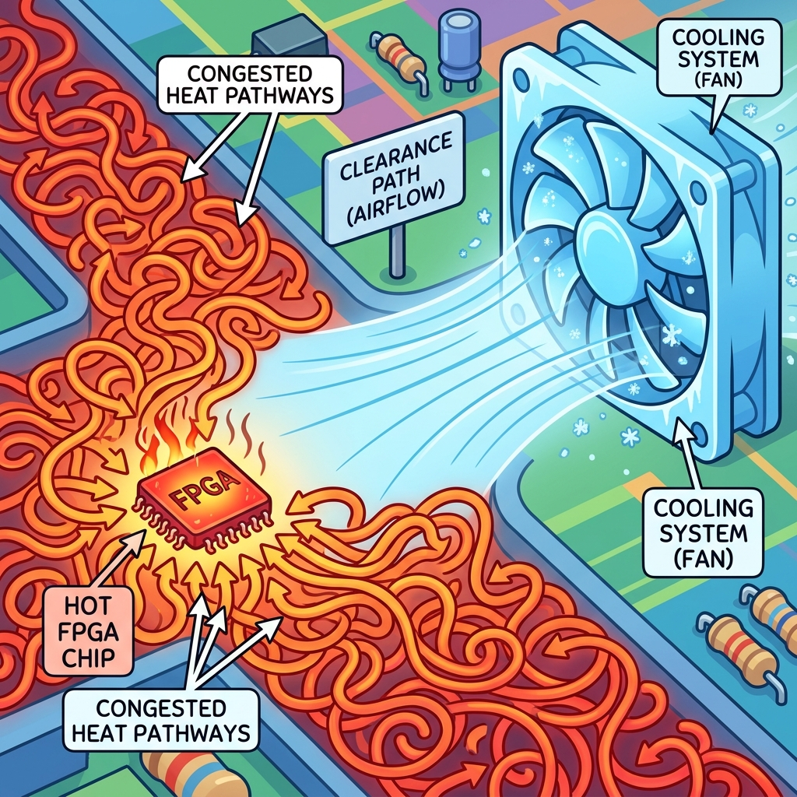
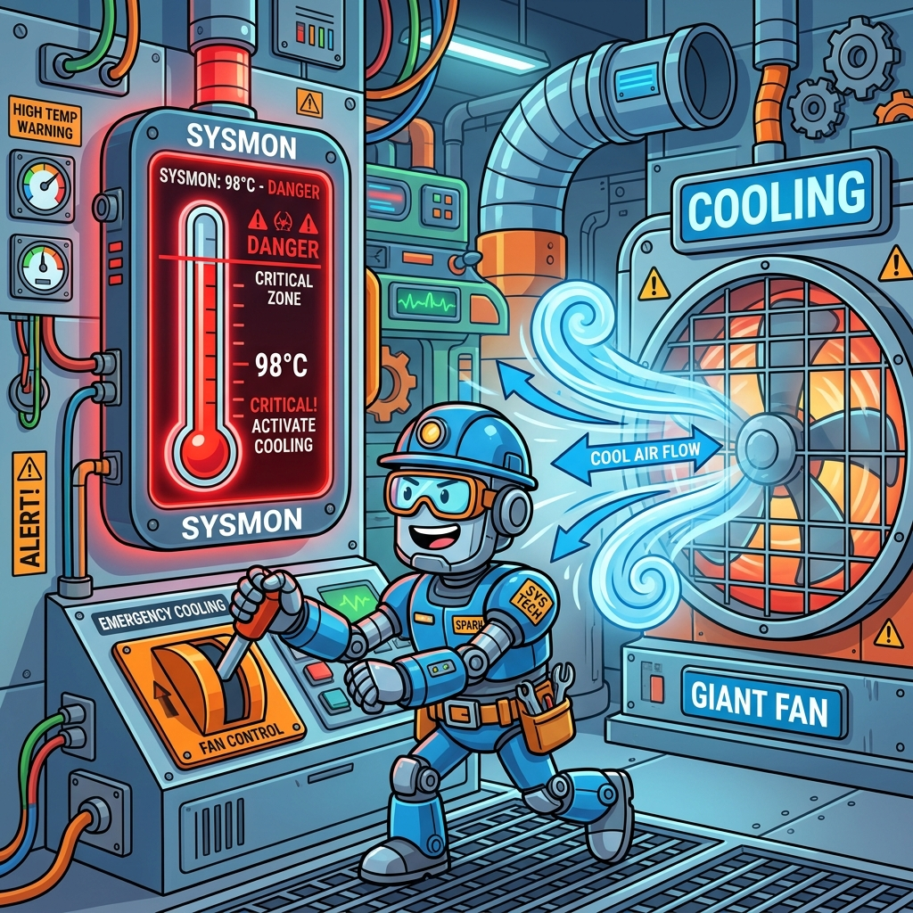

# Section 5.2: Thermal Design and Cooling: The Heat Sink Hero

You’ve optimized your power, but you can’t eliminate it entirely. Every watt of power consumed by your FPGA is converted directly into heat. If that heat isn't removed, the internal temperature of the chip will rise until it reaches the **Thermal Shutdown** limit. At that point, the chip will turn itself off to prevent permanent damage. If you're lucky, it just restarts. If you're unlucky, the thermal stress causes a "latch-up" that destroys the silicon.

In the AMD UltraFast Methodology, thermal design is about managing the journey of heat from the tiny transistors (the **Junction**) to the outside air. It’s a race against physics, and your primary weapon is the **Heat Sink Hero**.

### Junction Temperature (Tj): The Danger Zone

The most important number in your thermal design is the **Junction Temperature ($T_j$)**. This is the temperature of the actual silicon inside the package. Most AMD FPGAs have a maximum $T_j$ of 85°C (Commercial) or 100°C (Industrial).

Think of $T_j$ as your chip's "Internal Fever." If the fever gets too high, the chip starts acting erratically. Timing paths fail, bits flip randomly, and eventually, the whole system crashes. Your cooling system’s only goal is to keep $T_j$ comfortably below the limit, even on the hottest day of the year.

> **Brain Power**
> **If the air inside your chassis is 40°C, and your heat sink keeps the chip at 60°C, what is your 'Thermal Margin'? Why does this margin shrink as the FPGA utilization increases?**

### Thermal Resistance: The Traffic Jam for Heat

Heat doesn't just "disappear." it has to flow through multiple layers of material: the silicon, the package, the thermal paste, and finally the heat sink. Each of these materials has a **Thermal Resistance ($\theta$)**, measured in °C per Watt.

Think of thermal resistance like a traffic jam on the way to the airport. If the resistance is high, the heat gets backed up inside the chip, and $T_j$ skyrockets. To keep the chip cool, you need to minimize the resistance at every step. This means using high-quality thermal interface material (TIM) and a heat sink with plenty of surface area.



### Fireside Chat: The Fan and the Heatsink

**Heatsink:** "I’m the heavy lifter. I’ve got twenty fins and a massive copper base. I can absorb ten watts of heat without even breaking a sweat. I’m the foundation of this system."

**Fan:** "That’s cute, but without me, you’re just a hot piece of metal. You can absorb heat, but you can't get rid of it. The air around your fins gets hot and stays there. I’m the one who brings in the fresh, cool air and carries the heat away."

**Heatsink:** "I don't like moving parts. They're noisy and they fail. I’d rather just be bigger."

**Fan:** "You don't have the room to be bigger! The chassis is tiny. If you want this FPGA to survive, you need my airflow. Together, we’re a 'Thermal Solution.' Separately, we’re just a future service call."

### Cooling Strategies: Passive vs. Active

There are two main ways to keep an FPGA cool:

1.  **Passive Cooling:** Using a heatsink and natural convection (no fan). This is quiet and reliable, but it only works for low-power designs.
2.  **Active Cooling:** Using a fan to force air across the heatsink. This can handle much higher power but adds noise and a potential point of failure.

In some extreme cases (like high-end Alveo cards used in data centers), even a fan isn't enough. You might need **Liquid Cooling**, where a special fluid carries the heat away to a remote radiator. Choose the strategy that fits your power budget and your environment.

### Thermal Monitoring: The SysMon

How do you know if your cooling system is working? You use the **SysMon (System Monitor)**. This is a dedicated piece of hardware inside the FPGA that includes a temperature sensor.

You can read the SysMon through JTAG or through your own HDL logic. The UltraFast methodology recommends setting up **Thermal Alarms**. If the chip reaches 75°C, have your logic send a warning. If it reaches 85°C, have it go into a low-power "Sleep Mode" or shut down entirely. Don't fly blind—watch the SysMon and stay out of the danger zone.



### Code Detective: The Sleep Mode logic

You can use the SysMon's `OT` (Over-Temperature) output to trigger a safety shutdown in your code.

```verilog
// Code Detective: Why is this shutdown logic dangerous?
always @(posedge clk) begin
    if (sysmon_ot) begin
        logic_reset <= 1'b1; // Stop all switching to save power
    end else begin
        logic_reset <= 1'b0;
    end
end
// Hint: What happens if the clock itself is what's generating the heat?
```

The flaw here is that the shutdown logic depends on the system clock. If the FPGA is so hot that the clock distribution network is failing, this `always` block will never execute. A truly robust thermal shutdown should be **Asynchronous** or handled by a separate, low-speed "Watchdog" clock. Always have a "Plan B" that doesn't depend on the main high-speed fabric.

### Final Thoughts on the Heat

Thermal management is the final boundary of FPGA design. It’s where your digital logic meets the harsh reality of thermodynamics. By understanding junction temperature, minimizing thermal resistance, and monitoring the SysMon, you ensure that your design is not just fast, but also sustainable. Keep it cool, keep it running, and be the heat sink hero your project deserves.

---
[REVIEW_STATUS: APPROVED BY PUBLISHER]
