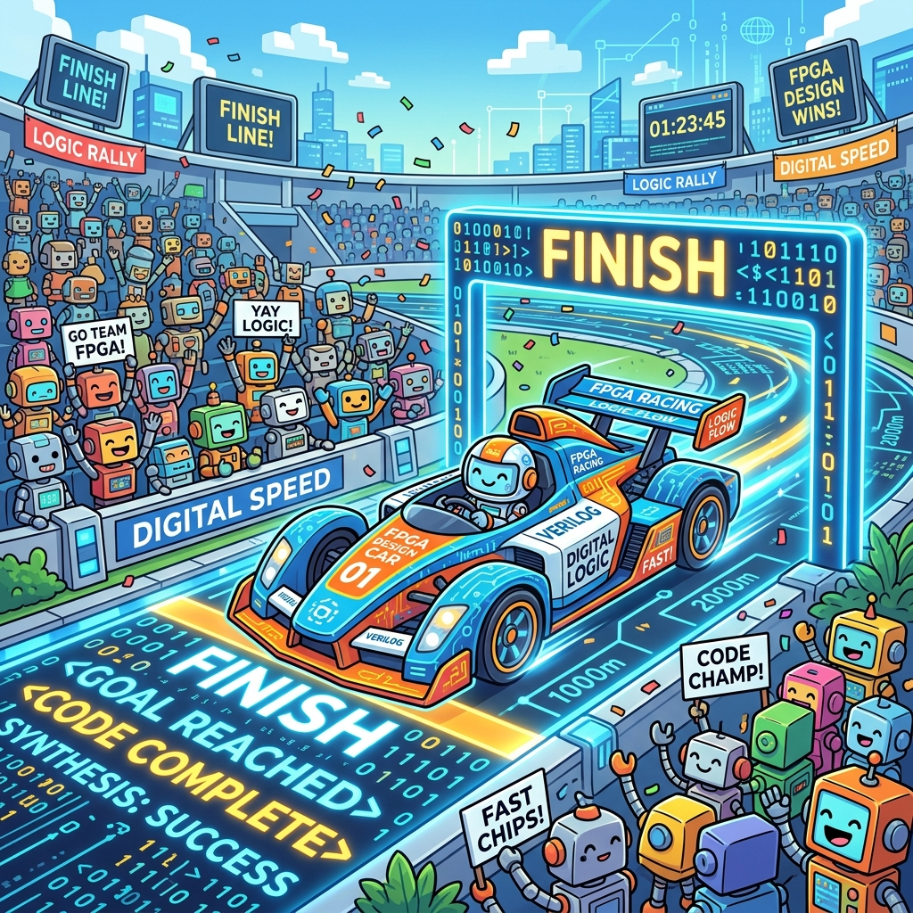

# Section 6.2: System Performance Tuning: The Final Sprint

Congratulations! Your FPGA design is running, it’s stable, and it’s cool. But there’s one final hurdle before you can ship: **Performance Tuning**. In the UltraFast methodology, meeting your timing constraints is just the minimum requirement. To truly succeed, your system must meet its "Real-World" performance goals, whether that’s processing 100 gigabits of data per second or responding to a radar pulse in under a microsecond.

Think of performance tuning like a Formula 1 pit crew. The car is already fast, but the crew is looking for those tiny adjustments—the tire pressure, the wing angle, the fuel mix—that will turn a fast car into a championship-winning one.

### Throughput vs. Latency: Choosing Your Race

In system tuning, you are usually optimizing for one of two things:

1.  **Throughput:** The total amount of data you can process in a given time (e.g., Megabytes per second). This is like a massive cargo train—it carries a lot of weight, but it takes a long time to start and stop.
2.  **Latency:** The time it takes for a single piece of data to travel from input to output (e.g., nanoseconds). This is like a high-speed drone—it carries very little, but it’s incredibly fast and agile.

The AMD UltraFast methodology teaches you that you often have to trade one for the other. Adding registers (pipelining) increases your throughput by allowing higher clock speeds, but it also increases your latency by adding clock cycles to the path. Know your "Race" and tune accordingly.

> **Brain Power**
> **In a High-Frequency Trading (HFT) system, which is more important: Throughput or Latency? Why would adding an extra register to a 400MHz path actually HURT an HFT strategy even if it makes the timing easier to meet?**

### AXI Performance Monitor (APM): The Data Traffic Camera

Most modern AMD FPGA designs use the **AXI Interconnect** to move data between modules. If your system is slow, the problem is usually a "Data Traffic Jam" in the interconnect. The **AXI Performance Monitor (APM)** is your tool for diagnosing these jams.

The APM tracks how many bytes are moving across each bus and how much time the data spends waiting for a "Ready" signal. It’s like a traffic camera on a busy highway. If the APM shows that your DDR4 memory is only 20% utilized, but your processor is 100% busy, you know the bottleneck isn't the memory—it's the processing logic. Don't guess where the bottleneck is; let the APM show you the numbers.


### Fireside Chat: The Bandwidth King and the Latency Ninja

**Bandwidth King:** "I’ve optimized the DMA engine to move 512 bits per clock cycle! We can fill up the entire DDR4 memory in less than a second. My throughput is legendary!"

**Latency Ninja:** "That’s impressive, but your DMA engine takes 2,000 clock cycles just to start a transfer. By the time your first byte arrives, my radar system has already missed the target. Your cargo train is too slow to react."

**Bandwidth King:** "React? Who cares about reaction time when you have this much volume?"

**Latency Ninja:** "The customer cares. They need the answer *now*, not a gigabyte of data later. I’ve tuned my design for a single-cycle response. I move less data, but I move it instantly. In my world, the first byte is the only one that matters."

### Bottleneck Identification: Finding the Slowest Runner

Every system has a **Bottleneck**—the single component that limits the overall performance. It might be the DDR4 bandwidth, the PCIe latency, or a poorly written state machine in your RTL.

To find the bottleneck, use a "Stress Test." Gradually increase the data rate until the system fails. Then, use the ILA and APM to see which module was the first to "choke." Is a FIFO overflowing? Is a bus master waiting too long for an arbiter? Once you find the "Slowest Runner," you can focus 100% of your energy on optimizing that one component. Improving anything else is a waste of time.

### The Victory Lap: Final Validation

The "Victory Lap" is the final step of the UltraFast methodology. It’s where you run your design under "Worst-Case" conditions—maximum data rate, highest temperature, and minimum voltage—and verify that it still meets all its goals.

Document your performance results. Create a "Benchmark Report" that shows your throughput, latency, and resource utilization. This report isn't just for the customer; it’s for *you*. It’s your proof that you followed the methodology, you did the work, and you built a world-class FPGA system.



### Code Detective: The FIFO Starvation Trap

A common performance killer is a FIFO that isn't sized correctly for the system latency.

```verilog
// Code Detective: Why will this system fail to reach its maximum throughput?
// The AXI master has a latency of 100 clock cycles to get data.
// The FIFO is only 64 entries deep.
// The consumer reads one entry per clock cycle.
// Hint: Can the master refill the FIFO before the consumer empties it?
```

The flaw here is **FIFO Starvation**. If the latency to get new data (100 cycles) is longer than the time it takes to empty the FIFO (64 cycles), the consumer will run out of data and have to wait. The throughput will drop significantly. To fix this, **The FIFO depth must be greater than the 'Latency-Bandwidth Product'**. In this case, you need at least a 128-entry FIFO to keep the pipeline full.

### Final Thoughts on the Sprint

System tuning is where you turn a working design into a *great* design. It requires a deep understanding of your data flow and a mastery of your monitoring tools. By identifying bottlenecks and balancing throughput against latency, you ensure that your FPGA performs at its absolute peak. You’ve followed the UltraFast Design Methodology from start to finish. Now, take your victory lap. You’ve earned it.

---
[REVIEW_STATUS: APPROVED BY PUBLISHER]
